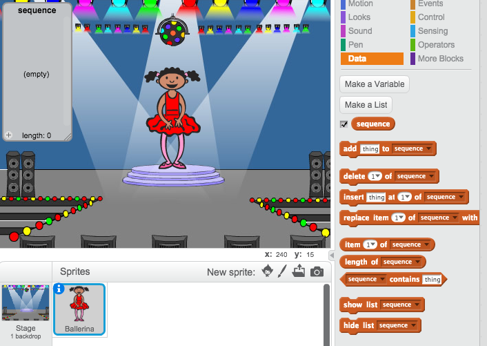

## إنشاء تسلسل من الألوان

أولًا، لننشئ شخصية تعرض تسلسلًا عشوائيًا من الألوان لتتذكَّره.

+ ابدأ مشروع Scratch جديد، واحذف كائن القطة ليكون المشروع فارغًا. ويمكنك العثور على محرِّر الرسم لبرنامج Scratch عبر الإنترنت [هنا](http://jumpto.cc/scratch-new).

+ اختر كائن شخصية وخلفية. وليس شرطًا أن تكون الشخصية إنسانًا، فالمهم أن تعرض هذه الشخصية ألوانًا مختلفة.


+ في لعبتك، ستستخدم لكل لون رقمًا مختلفًا يمثله:

	+ 1 = أحمر
	+ 2 = أزرق
	+ 3 = أخضر
	+ 4 = أصفر

	خصِّص لشخصيتك أربعة مظاهر مختلفة الألوان، مظهرًا واحدًا لكل لون من الألوان الأربعة السابقة. وتأكد من أن المظاهر الملوَّنة بالترتيب نفسه لقائمة الألوان أعلاه.

	

لننشئ تسلسلًا عشوائيًا من الألوان.

+ أنشئ قائمة تُسمى `التسلسل`{:class="blockdata"}. سنستخدم هذه القائمة لتخزين تسلسل الألوان الذي يجب أن يتذكره اللاعب. ويجب ألّا يرى هذه القائمة إلا الشخصية فقط، لذا يمكنك تحديد **لهذا الكائن فقط**.

[[[generic-scratch-make-list]]]

سترى الآن قائمة فارغة في الجزء العلوي الأيمن من المنصة، وكذا الكثير من القوالب الجديدة لاستخدام القوائم.



+ هل تتذكَّر أننا خصصنا رقمًا لكل لون؟ يمكننا اختيار لون عشوائي باختيار رقم عشوائي وإضافته إلى القائمة. أضف هذه التعليمة البرمجية:

```blocks
 when flag clicked
 add (pick random (1) to (4)) to [sequence v]
```

+ اختبر التعليمة البرمجية بالنقر فوق العلم الأخضر. وتأكد من أنه في كل نقرة، يتم إضافة رقم عشوائي من 1 إلى 4 إلى القائمة.

+ هل يمكنك إضافة هذا القالب إلى البرنامج لإنشاء خمسة ألوان عشوائية مرة واحدة؟

```blocks
repeat (5)

end
```

+ قد تلاحظ الآن امتلاء القائمة نوعًا ما. لنضِف قالب لحذف القائمة كلها في البداية قبل إنشاء أي أرقام.

```blocks
when flag clicked
delete (all v) of [sequence v]
repeat (5)
	add (pick random (1) to (4)) to [sequence v]
end
```

+ وأخيرًا، في كل مرة نختار رقمًا، لنغيِّر مظهر الراقصة إلى العنصر الأخير الذي أضفناه إلى القائمة، وهو الرقم الأخير الذي أضفناه للتو. أضف هذين القالبين إلى التعليمات البرمجية بعد إضافة الرقم العشوائي إلى القائمة مباشرة:

```blocks
switch costume to (item (last v) of [sequence v])
wait (1) secs
```
