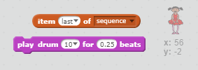

--- challenge ---
## التحدي: إضافة صوت

اختبر مشروعك عدة مرات. قد تلاحظ اختيار الرقم نفسه مرتين (أو أكثر) في صف واحد أحيانًا، وهو ما يجعل تذكر التسلسل صعبًا. هل يمكنك تشغيل صوت الطبلة في كل مرة تغير الشخصية مظهرها؟

هل يمكنك تشغيل صوت مختلف للطبلة وفقًا للرقم الذي يتم اختياره؟ سيكون ذلك مشابهًا _جدًا_ للتعليمات البرمجية الخاصة بتغيير مظهر الشخصية.

--- hints ---
--- hint ---
يمكنك اجتياز هذا التحدي بإضافة قالبين فقط إلى التعليمات البرمجية الحالية للشخصية!
--- /hint ---
--- hint ---
فيما يلي القالبان اللذان ستحتاج إليهما:


--- /hint ---

--- hint ---
يجب أن تكون التعليمات البرمجية النهائية كما يلي:
```blocks
when flag clicked
delete (all v) of [sequence v]
repeat (5)
	add (pick random (1) to (4)) to [sequence v]
    play drum (item (last v) of [sequence v]) for (0.25) beats
    switch costume to (item (last v) of [sequence v])
    wait (1) secs
end
```
--- /hint ---

--- /hints ---

--- /challenge ---
