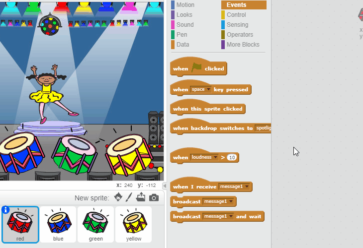

## تكرار التسلسل

لنضِف أربعة أزرار ليضغط عليها اللاعب لتكرار التسلسل الذي يتذكره.

+ أضف أربعة كائنات جديدة إلى مشروعك لمثل الأزار الأربعة. ثم قم بتحرير المظاهر بحيث يوجد كائن واحد في كل من الألوان الأربعة. رتِّب الكائنات بالترتيب نفسه للمظاهر — أحمر، أزرق، أخضر، أصفر.


+ عن النقر فوق الطبلة الحمراء، ستحتاج إلى بث رسالة إلى الشخصية لتعرف أنه تم النقر فوق الزر الأحمر. أضف هذه التعليمة البرمجية إلى الطبلة الحمراء:

```blocks
	when this sprite clicked
	broadcast [red v]
```

يُشبه البث إذاعة إعلان عبر مكبر صوت — ربما تسمع ذلك عندما تتسوق في السوبر ماركت. ستتلقى كل الكائنات رسالة البث، لكن لن ينفِّذ أيَّ إجراء إلا الكائنُ المخصص للاستجابة.

+ أضف تعليمة برمجية مشابهة إلى الطبلات الزرقاء والخضراء والصفراء لتجعل كلًا منها تبث رسالة تعلن عن لونها الخاص.

--- hints ---
--- hint ---
هذه طريقة سهلة لنسخ التعليمة البرمجية من كائن إلى آخر. غيِّر رسالة البث في كل كائن لتطابق لون الكائن.

--- /hint ---
--- /hints ---

هل تذكر أننا قلنا إن البث يشبه إذاعة إعلان عبر مكبر الصوت؟ لن ينفِّذ أيَّ إجراء إلا الكائنُ المخصص للاستجابة، إذًا لنجعل وظيفة كائن الشخصية هي الاستجابة للرسائل. ونفعل ذلك بكتابة بعض التعليمات البرمجية لتنفِّذها الشخصية عندما تتلقى كل رسالة.

 + عندما تتلقى الشخصية الرسالة `أحمر`، يجب أن تتحقق التعليمة البرمجية مما إذا كان الرقم `1` في بداية القائمة أم لا (وهو ما يعني أن `أحمر` هو اللون التالي في التسلسل).

 إذا كان ذلك صحيحًا، فيجب أن تحذف التعليمة البرمجية هذا الرقم من القائمة، لأن تخمين اللون كان صحيحًا. وإلا فستنتهي اللعبة، وسنحتاج إلى القالب `أوقف الكل`{:class="blockcontrol"} لإنهاء اللعبة.

```blocks
	when I receive [red v]
	if <(item (1 v) of [sequence v])=[1]> then
		delete (1 v) of [sequence v]
	else
		say [Game over!] for (1) secs
		stop [all v]
	end
```

+ أضف إلى التعليمة البرمجية التي كتبتَها للتو بحيث يدق إيقاع طبلة عند تلقي اللون الصحيح.

--- hints ---
--- hint ---
هل يمكنك استخدام الأرقام المطابقة لكل لون لتشغيل إيقاع الطلبة الصحيح؟
+ 1 = أحمر
+ 2 = أزرق
+ 3 = أخضر
+ 4 = أصفر
--- /hint ---
--- hint ---
ستحتاج إلى إضافة القالب `دق الطبلة`{:class="blocksound"} لتشغيل الصوت الأول في قائمة التسلسل قبل القالب `احذف 1 من التسلسل`{:class="blockdata"}:


--- /hint ---
--- hint ---
هذه هي التعليمة البرمجية التي ستحتاج إلى إضافتها:

```blocks
play drum (item (1 v) of [sequence v]) for (0.25) beats
```
--- /hint ---
--- /hints ---

+ ضاعف التعليمة البرمجية التي استخدمتَها لتجعل الشخصية تستجيب للرسالة `أحمر`. وفي هذه المرة، غيِّر الرسالة إلى `أزرق`.

عندما يستجيب الكائن للرسالة `أزرق`، أي جزء من التعليمة البرمجية يجب أن يقول الشيء نفسه، وأي جزء يجب أن يتغير؟ تذكَّر أن لكل لون رقمًا مطابقًا.

+ غيِّر التعليمة البرمجية بحيث تستجيب الشخصية بشكل صحيح للرسالة `أزرق`.

--- hints ---
--- hint ---
اترك هذين القالبين في التعليمات البرمجية، لكنك ستحتاج إلى تغيير العنصر بطريقة ما:

--- /hint ---
--- hint ---
يجب أن تكون التعليمة البرمجية لبث رسالة اللون الأزرق كما يلي.

```blocks
	when I receive [blue v]
	if <(item (1 v) of [sequence v])=[2]> then
        play drum (item (1 v) of [sequence v]) for (0.25) beats
		delete (1 v) of [sequence v]
	else
		say [Game over!] for (1) secs
		stop [all v]
	end
```

--- /hint ---
--- /hints ---

+ ضاعف التعليمة البرمجية مرتين أخريين للزرَّين الأخضر والأصفر، وغيِّر الأجزاء اللازمة لتستجيب الشخصية بشكل صحيح.

+ تذكَّر أن تختبر التعليمة البرمجية التي أضفتها! هل تستطيع تذكر تسلسل من خمسة ألوان؟ هل التسلسل مختلف في كل مرة؟

يمكنك أيضًا عرض بعض الأضواء الوميضية كجائزة بالفوز بمجرد أن تصبح القائمة فارغة، لأن ذلك يعني تذكُّر التسلسل كله بشكل صحيح.

+ أضف هذه التعليمة البرمجية إلى نهاية النص البرمجي `عند النقر فوق العلم`{:class="blockevents"} للشخصية:

```blocks
	wait until < (length of [sequence v]) = [0]>
	broadcast [won v] and wait
```

+ انتقل إلى المنصة، وأضف هذه التعليمة البرمجية لتشغيل صوت وتغيير لون الخلفية بمجرد أن يفوز اللاعب. يمكنك اختيار أي صوت يعجبك!

```blocks
	when I receive [won v]
	play sound [drum machine v]
	repeat (50)
		change [color v] effect by (25)
		wait (0.1) secs
	end
	clear graphic effects
```
