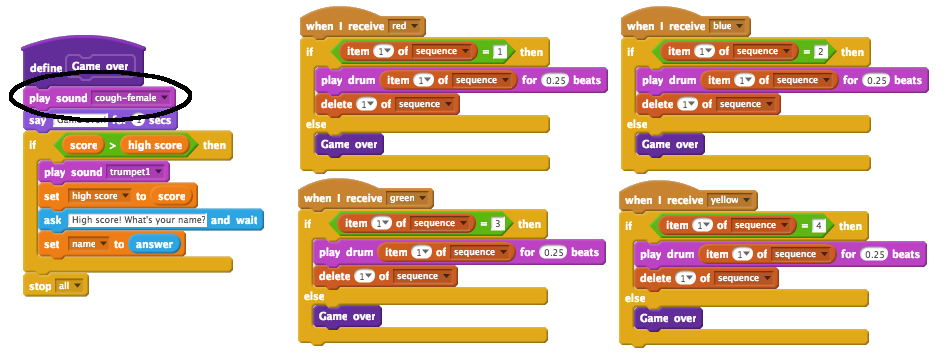

## أعلى نتيجة

لنقم بحفظ أعلى نتيجة، بحيث يمكنك تحدي أصدقائك.

+ أضف متغيرَين جديدَين أحدهما يُسمى `أعلى نتيجة`{:class="blockdata"} والآخر يُسمى `الاسم`{:class="blockdata"} إلى مشروعك.

عندما تنتهي اللعبة بسبب خطأ اللاعب في تخمين التسلسل، ستحتاج إلى التحقق مما إذا كانت نتيجته أعلى من النتيجة الحالية أم لا. إذا كانت كذلك، فإنك تحتاج إلى حفظ النتيجة كأعلى نتيجة، ثم تخزين اسم اللاعب.

+ أضف تعليمة برمجية إلى كائن الشخصية لتخزين أعلى نتيجة. واسأل اللاعب عن اسمه أيضًا ثم سجِّله في المتغير `الاسم`{:class="blockdata"}.

[[[generic-scratch-high-score]]]

--- hints ---
--- hint ---
يجب أن تتبع التعليمة البرمجية الجديدة المنطقَ التالي:
بعد رسالة `انتهت اللعبة`
`إذا` كانت `النتيجة` `أكبر من` `أعلى نتيجة`
`فعيِّن` `أعلى نتيجة` إلى `النتيجة`
`اسأل` اللاعب عن اسمه
`عيِّن` `الاسم` إلى `الإجابة`
--- /hint ---
--- hint ---
ستحتاج إلى القوالب التالية:


--- /hint ---
--- hint ---
يجب أن تكون التعليمات البرمجية عندما يتم الضغط على الزر الأحمر كما يلي:

```blocks
	when I receive [red v]
	if <(item (1 v) of [sequence v])=[1]> then
		delete (1 v) of [sequence v]
	else
		say [Game over!] for (1) secs
		if < (score) > (high score) > then
			set [high score v] to (score)
			ask [High score! What is your name?] and wait
			set [name v] to (answer)
		end
		stop [all v]
	end
```

--- /hint ---
--- /hints ---

+ ستحتاج إلى إضافة هذه التعليمة البرمجية الجديدة إلى كائن الشخصية للألوان الثلاثة الأخرى أيضًا! هل لاحظتَ أن التعليمات البرمجية 'انتهت اللعبة' لكل من الألوان الأربعة متماثلة تمامًا؟


إذا احتجتَ في أي وقت إلى تغيير أي شيء في هذه التعليمة البرمجية، كإضافة صوت أو تغيير الرسالة 'انتهت اللعبة' مثلًا، فستحتاج إلى تغييره أربع مرات. ويمكن أن يكون ذلك مملًا ومضيعة للوقت.

بدلًا من ذلك، يمكنك تعريف القوالب الخاصة بك وإعادة استخدامها في مشروعك. لتفعل ذلك، انقر فوق `قوالب برمجية أخرى`{:class="blockmoreblocks"}، ثم انقر فوق **إنشاء قالب برمجي**. وسمِّ هذا القالب الجديد 'انتهت اللعبة'.


+ أضف التعليمة البرمجية من قالب `else`{:class="blockcontrol"} المرتبطة بالزر الأحمر إلى القالب الذي أنشأته:


+ لقد أنشأتَ الآن _دالة_ تُسمى `انتهت اللعبة`{:class="blockmoreblocks"}، والتي يمكنك استخدامها في أي مكان تريده. اسحب القالب الجديد `انتهت اللعبة`{:class="blockmoreblocks"} إلى النصوص البرمجية الأربعة للأزرار.


+ أضف الآن صوتًا ليتم تشغيله عند الضغط على الزر الخطأ. ستحتاج إلى إضافة هذه التعليمة البرمجية مرة واحدة فقط في القالب `انتهت اللعبة`{:class="blockmoreblocks"} التي أنشأتَها، لا أربع مرات منفصلة!


