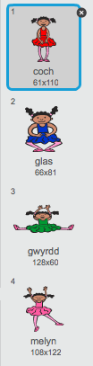
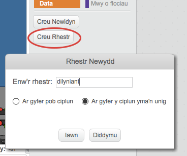
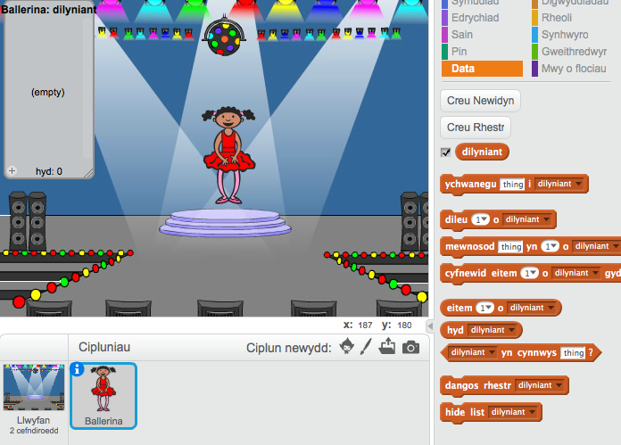

## Lliwiau ar hap

Yn gyntaf, fe wnawn ni greu cymeriad sydd yn gallu newid ei gwisg yn ôl dilyniant o liwiau ar hap.

+ Cychwyna brosiect Scratch newydd, a dileu ciplun y gath fel bod y prosiect yn wag. Mae'r golygydd Scratch arlein yma <a href="http://jumpto.cc/scratch-new" target="_blank">jumpto.cc/scratch-new</a>.

+ Dewisa gymeriad a chefndir. Does dim rhaid i dy gymeriad fod yn berson, ond mae'n rhaid iddo allu dangos lliwiau gwahanol.

	

+ In your game, you'll use a different number to represent each colour:

	+ 1 = coch;
	+ 2 = glas;
	+ 3 = gwyrdd;
	+ 4 = melyn.

	Rho 4 wisg lliw gwahanol i dy gymeriad, un ar gyfer y 4 lliw uchod. Gwna'n siwr bod dy wisgoedd yn y drefn gywir.

	

+ I greu dilyniant ar hap, mae angen i ti greu __rhestr__. Mae rhestr yn newidyn sydd yn storio llawer o ddata __mewn trefn__. Gwna restr newydd o'r enw `dilyniant`{:class="blockdata"}. Gan mai dim ond dy gymeriad sydd angen gweld y rhestr, gallwn hefyd glicio 'Ar gyfer y ciplun yma yn unig'.

	

	Fe ddyle ti nawr weld dy restr gwag ar ochr top-chwith y llwyfan, yn ogystal â llawer o flociau newydd ar gyfer defnyddio'r rhestr.

	

+ Ychwanega'r côd yma i dy gymeriad, i ychwanegu rhif ar hap i dy restr (a dangos y lliw cywir) 5 o weithiau:

	```blocks
		pan fo ⚑ wedi ei glicio
			dileu (y cyfan v) o [dilyniant v]
			ailwna (5)
  		ychwanegu (dewis ar hap (1) i (4)) i [dilyniant v]
   		newid i wisg (eitem (last v) o [dilyniant v])
   			aros (1) eiliad
		end
	```

	Sylwa dy fod di hefyd wedi gwagio y rhestr i gychwyn.
