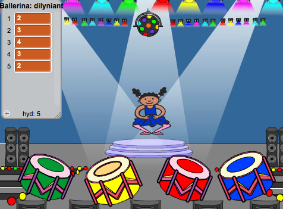

## Ailadrodd y dilyniant

Fe wnawn ni ychwanegu 4 botwm i'r chwareuwr ail-adrodd y dilyniant mae nhw wedi ei gofio.

+ Ychwanega 4 ciplun i dy brosiect, fydd yn fotymau. Golyga dy 4 ciplun, fel bod 1 ar gyfer pob lliw.

	

+ Pan mae dy ddrwm coch wedi clicio, bydd angen i ti ddarlledu neges i dy gymeriad, fydd yn gadael iddo wybod fod y botwm coch wedi clicio. Ychwanega'r côd yma i'r drwm coch:

	```blocks
		pan caiff y cymeriad ei glicio
		darlledu [coch v]
	```

+ Pan mae dy gymeriad yn derbyn y neges yma, fe ddylai wirio os mai rhif 1 sydd ar ddechrau'r rhestr (sydd yn golygu mai coch yw'r lliw nesaf yn y dilyniant).  Os mai dyma'r ateb, fe alli di gael gwared o'r rhif o'r rhestr, gan fod yr ateb yn gywir. Neu mae'r gêm drosodd!

	```blocks
		pan dderbyniaf [red v]
			os <(eitem (1 v) o [dilyniant v]) = [1]> wedyn
  			dileu (1 v) o [dilyniant v]
		fel arall
   			dweud [Gêm drosodd!] am (1) eiliad
   			stopiwch [y cyfan v]
		end
	```

+ Mae modd i ti hefyd ddarlledu goleuadau yn fflachio unwaith bod y rhestr yn wag, sydd yn golygu fod y dilyniant cyfan wedi cael ei ddyfalu'n gywir. Ychwanega'r côd yma i ddiwedd sgript un o dy gymeriadau `pan fo baner wedi ei glicio`{:class="blockevents"}:

	```blocks
		aros hyd at <(hyd [dilyniant v]) = [0]>
		darlledu [ennill v] ac aros

	```

+ Clicia ar dy lwyfan, ac ychwanega'r côd yma i chwarae __unrhyw__ sŵn a gwneud i'r cefndir newid lliw unwaith mae'r chwareuwr wedi ennill.

	```blocks
		pan dderbyniaf [ennill v]
			chwarae sain [drum machine v]
			ailwna (50)
   		newid effaith [lliw v] gan (25)
   		aros (0.1) eiliad
	end
		clirio effeithiau graffeg
	```
