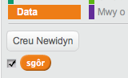

## Lefelau gwahanol

Hyd yn hyn, mae'r chwareuwr ond wedi gorfod cofio 5 lliw.  Beth am wella'r gêm, fel bod hyd y dilyniant yn cynyddu.

+ Gwna newidyn newydd o'r enw `sgôr`{:class="blockdata"}.

	

+ Bydd y `sgôr`{:class="blockdata"} yn cael ei ddefnyddio i benderfynu hyd y dilyniant bydd angen i'r chwareuwr ei gofio.  Felly, fe wnawn ni ddechrau gyda'r sgôr (a hyd y dilyniant) o 3. Ychwanega'r bloc côd yma ar ddechrau côd dy gymeriad `pan fo baner wedi ei glicio`{:class="blockevents"}:

	```blocks
		gosod [sgôr v] i [3]
	```

+ Yn lle creu dilyniant o 5 lliw bob tro, rwyt ti nawr eisiau i'r sgôr i benderfynu hyd y dilyniant. Newida ddolen `am byth`{:class="blockcontrol"} dy gymeriad (i greu y dilyniant) i:

	```blocks
		ailwna (sgôr)
		end
	```

+ Os yw'r dilynant yma yn cael ei ddyfalu'n gywir, fe ddyle ti ychwanegu 1 i'r sgôr i gynyddu hyd y dilyniant.

	```blocks
		newid [sgôr v] gan (1)
	```

+ Yn olaf, bydd angen i ti ychwanegu dolen `am byth`{:class="blockcontrol"} o amgylch y côd i greu y dilyniant, fel bod dilyniant newydd yn cael ei greu ar gyfer pob lefel. Dyma sut ddylai côd dy gymeriad edrych:

	```blocks
		pan fo ⚑ wedi ei glicio
		gosod [sgôr v] i [3]
		am byth
   			dileu (y cyfan v) o [dilyniant v]
   			ailwna (sgôr)
      		ychwanegu (dewis ar hap (1) i (4)) i [dilyniant v]
      		newid i wisg (eitem (olaf v) o [dilyniant v])
      		aros (1) eiliad
   		end
   			aros hyd at <(hyd [dilyniant v]) = [0]>
   			darlledu [ennill v] ac aros
   			newid [sgôr v] gan (1)
		end
	```

+ Gofyn i dy ffrindiau i brofi dy gêm. Cofia guddio y rhestr `dilyniant`{:class="blockdata"} cyn eu bod yn ei chwarae!
