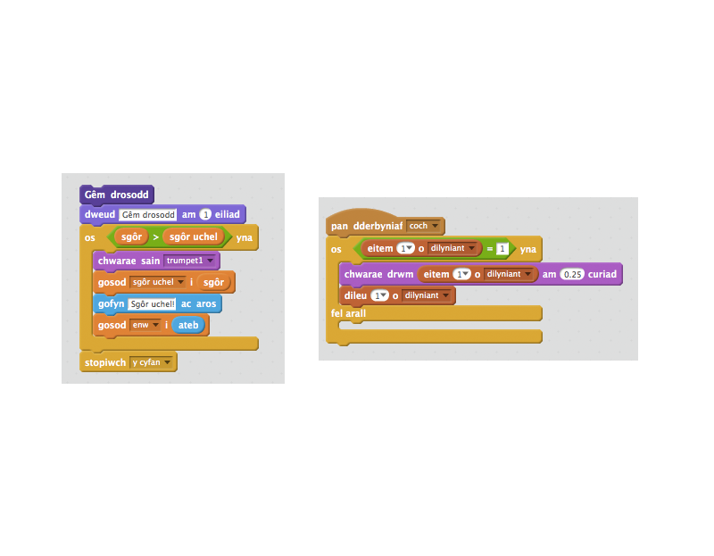

## Sgôr Uchel

Beth am arbed y sgôr uchel, fel dy fod di'n gallu chwarae yn erbyn dy ffrindiau.

+ Ychwanega 2 newidyn newydd i dy brosiect, o'r enw `sgôr uchel`{:class="blockdata"} ac `enw`{:class="blockdata"}.

+ Os yw'r gêm byth yn gorffen (trwy wasg'r botwm anghywir), bydd angen i ti weld os yw sgôr y chwareuwr yn uwch na'r sgôr uchel presennol.  Os yw e, bydd angen i ti arbed y sôr fel y sgôr uchel, a'i storio dan enw'r chwareuwr.  Dyma sut ddylai dy fotwm coch edrych:

If ever the game ends (by pressing the wrong button), you need to check whether the player's score is higher than the current high score. If it is, you need to save the score as the high score, and store the name of the player. Here's how your red button should look:

```blocks
		pan fyddaf yn derbyn [coch v]
		  os <(eitem (1 v) o [dilyniant v]) = [1]> wedyn
   			dileu (1 v) o [dilyniant v]
		  fel arall
   			dweud [Gêm drosodd!] am (1) eiliad
   		os <(sgôr) > (sgôr uchel)> wedyn
      		gosod [sgôr uchel v] i (sgôr)
      		gofyn [Sgôr uchel! Beth yw dy enw?] ac aros
   	   		gosod [enw v] i (ateb)
   		  end
   		  stopiwch [y cyfan v]
		end
```
+ Bydd angen i ti ychwanegu'r côd newydd yma i'r 3 botwm arall hefyd! Wyt ti wedi sylw bod y côd 'Gêm drosodd' ym mhob un o'r 4 botwm yn union yr un peth?

	

+ Os wyt ti byth eisiau newid rhan o'r côd yma, fel ychwanegu sain neu newid y neges 'Gêm drosodd!', bydd angen i ti ei newid 4 gwaith! Gall hwnna fod yn boen, ac yn wastraff amser.

	Yn hytrach, mae modd i ti ddiffinio dy flociau dy hunan, a'u ail-defnyddio ar gyfer dy brosiect! I wneud hyn, clicia `mwy o flociau`{:class="blockmoreblocks"}, ac yna 'Creu bloc'. Galwa'r bloc yma yn 'Gêm drosodd'.

	

+ Ychwanega'r côd yma o'r bloc `fel arall`{:class="blockcontrol"} yn y botwm coch i'r bloc newydd sydd yn ymddangos:

	

+ Rwyt ti nawr wedi creu _gweithred_ newydd o'r enw `Gêm drosodd`{:class="blockmoreblocks"}, ac mae modd i ti ei ddefnyddio lle bynnag wyt ti eisiau. Llusga'r bloc `Gêm drosodd`{:class="blockmoreblocks"} i'r 4 o sgriptiau ar gyfer y botymau.

	

+ Nawr ychwanega sain pan mae botwm anghywir yn cael ei gwasg.  Rwyt ti ond angen ychwanegu'r côd _unwaith_ yn y bloc `Gêm drosodd`{:class="blockmoreblocks"} ti wedi ei greu, a dim 4 gwaith arwahan! 

	
