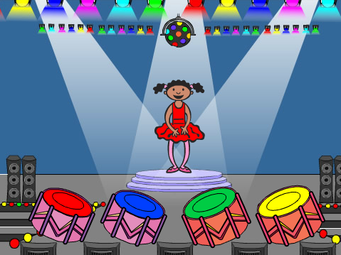

--- no-print ---

This is the **Scratch 2** version of the project. There is also a [Scratch 3 version of the project](https://projects.raspberrypi.org/de-DE/projects/memory).

--- /no-print ---

## Einführung

In diesem Projekt erstellst Du ein Gedächtnis-Spiel, bei dem man sich eine Folge von zufälligen Farben merken und wiederholen muss!

  <iframe allowtransparency="true" width="485" height="402" src="https://scratch.mit.edu/projects/embed/34874510/?autostart=false" frameborder="0"></iframe>
  

## Ressourcen
Für dieses Projekt sollte Scratch 2 entweder online unter [jumpto.cc/scratch-on](http://jumpto.cc/scratch-on) verwendet oder hier [jumpto.cc/scratch-off](http://jumpto.cc/scratch-off) heruntergeladen und offline benutzt werden.

Eine vollständige Version des Projektes kann hier eingesehen <a href="http://scratch.mit.edu/projects/34874510/#editor">online</a> oder unter dem 'Download Project Materials'-Link, der folgendes enthält, heruntergeladen werden:

+ Gedächtnis.sb2

## Lernziele
+ Listen
+ Einfache Funktionen

## Herausforderungen
+ "Geräusche hinzufügen" - Benutzerfreundlichkeit des Spieles verbessern;
+ "4 tasten erstellen" - Listen manipulieren;
+ "Mehr Blöcke erstellen" - benutzerdefinierte Blöcke erstellen;
+ "Anderes Kostüm" - Benutzerfreundlichkeit des Spieles verbessern;
+ "Schwierigkeitsgrad" - in einer Liste gespeicherten Daten modifizieren.
