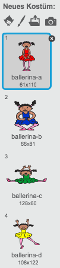
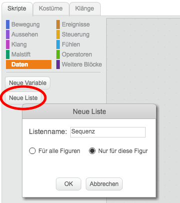
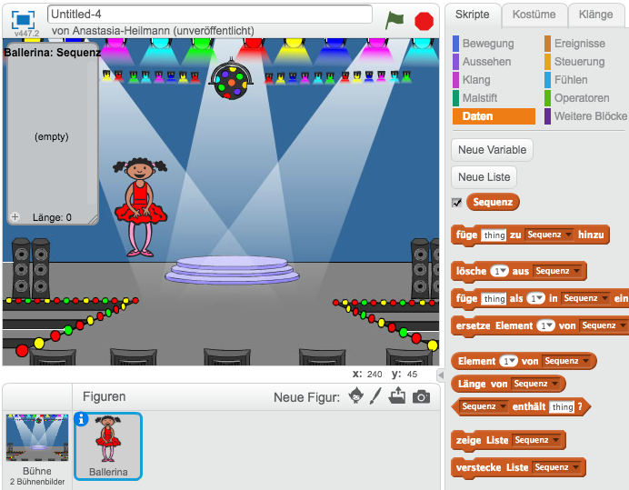

## Zufällige Farben

Lass uns zunächst einen Charakter erstellen, der eine zufällige Reihenfolge an unterscheidlichen Farben annehmen kann, die sich der Spieler merken muss.

+ Starte ein neues Scratch-Projekt und lösche die Katzenfigur, so dass Dein Projekt leer ist. Du findest das Scratch-Bearbeitungsprogramm online auf jumpto.cc/scratch-new.

+ Füge eine neue Figur, sowie den passeden Bühnenhintergrund hinzu. Dein Charakter muss keine Person sein, aber er muss verschiedene Farben annehmen können.

	

+ Du wirst im Spiel unterschiedliche Zahlen für die jeweiligen Farben benutzen:

	+ 1 = rot
	+ 2 = blau
	+ 3 = grün
	+ 4 = gelb

	Gib Deinem Charakter vier unterschiedlich farbige Kostüme in den obigen Farben. Stelle sicher, dass die Farben der Kostüme richtig geordnet sind.

	

+ Um eine zufällige Reihenfolge zu erstellen, benötigst Du eine __Liste__. Eine Liste ist lediglich eine Variable, die viele Daten __in Reihenfolge__ speichert. Erstelle unter 'Daten'  eine neue Liste namens `Sequenz`{:class="blockdata"}. Da nur Dein Charakter die Liste sehen muss, können wir auf 'Nur für diese Figur' klicken.

	

	Du solltest nun sowohl Deine leere Liste in der oberen linken Ecke Deiner Bühne sehen, als auch eine Menge neuer Bausteine für die Verwendung der Liste.

	

+ Füge diesen Code hinzu, um der Liste 5 Mal nacheinander eine zufällige Nummer zu vergeben (und so das entsprechende Kostüm anzuzeigen):

	```blocks
Wenn die grüne Flagge angeklickt
lösche (alles v) aus [Sequenz v]
wiederhole (5) mal
   füge (Zufallszahl von (1) bis (4)) zu [Sequenz v] hinzu
   wechsle zu Kostüm (Element (last v) von [Sequenz v])
   warte (1) Sek.
Ende
	```

	Beachte, dass Du die Anfangsliste leerst, um zu beginnen.
