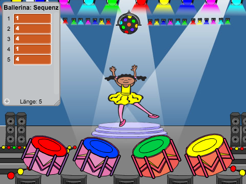

## Reihenfolge wiederholen

Lass uns vier Tasten hinzufügen, damit man die gemerkte Reihenfolge der Farben abspielen kann.

+ Füge Deinem Projekt vier Figuren hinzu, die die Tasten darstellen werden. Bearbeite Deine Figuren so, dass jeweils eine Taste eine der vier Farben repräsentiert.

	

+ Wenn die rote Taste angeklickt  wird, musst Du Deinem Charakter mitteilen, dass die rote Taste gedrückt wurde. Füge diesen Code Deiner roten Trommel hinzu:

```blocks
   Wenn ich angeklickt werde
   sende [rot v] an alle
```

+ Wenn dein Charakter diese Nachricht empfängt, sollte er prüfen, ob die Nummer 1 am Anfang der Liste steht (was bedeutet, dass Rot die nächste Farbe in der Reihenfolge ist). Wenn ja, kann die Nummer aus der Liste entfernt werden, da sie richtig erraten worden ist. Ansonsten ist das Spiel vorbei!

```blocks
  Wenn ich [rot v] empfange
  falls <(Element (1 v) von [Sequenz v]) = [1]> dann
   lösche (1 v) aus [Sequenz v]
  sonst
   sage [Game over!] für (1) Sek.
   stoppe [alles v]
  Ende
```

+ Du kannst auch ein paar blinkende Lichter anzeigen, sobald die Liste leer ist, da es bedeutet, dass die komplette Reihenfolge der Farben richtig erraten worden ist. Fügen diesen Code an das Ende des `wenn Fahne geklickt`{:class="blockevents"}-Skripts Deines Charakters hinzu:

```blocks
  warte bis <(Länge von [Sequenz v]) = [0]>
  sende [gewonnen v] an alle und warte
```

+ Klicke auf die Bühne und füge diesen Code hinzu, um die Farbe des Hintergrundes wechseln zu lassen, sobald der Spieler gewonnen hat.

```blocks
  Wenn ich [gewonnen v] empfange
  spiele Klang [cheer v]
  wiederhole (50) mal
   ändere [Farbe v]-Effekt um (25)
   warte (0.1) Sek.
  Ende
  schalte Grafikeffekte aus
```

## Herausforderung: Vier Tasten erstellen 
Wiederhole die oben beschriebenen Schritte für Deine blauen, grünen und gelben Tasten. Welcher Code bleibt gleich, und welcher Code verändert sich für jede der Tasten?

Du kannst auch Geräusche hinzufügen, wenn die Tasten gedrückt werden.

Denke daran, den Code, den Du hinzugefügt hast, zu testen! Kannst Du Dir eine Folge von 5 Farben merken? Ist die Reihenfolge jedes Mal anders?
