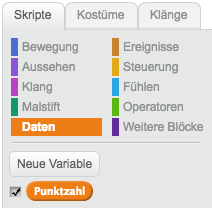

## Mehrere Ebenen

Bisher muss sich der Spieler nur 5 Farben merken. Lass uns Dein Spiel verbessern, so dass die Länge der Farbenfolge erhöht wird.

+ Erstelle eine neue Variable namens `Punktzahl`{:class="blockdata"}.

	

+ Diese `Punktzahl`{:class="blockdata"} wird dafür verwendet, um über die Länge Sequenz zu entscheiden, die sich der Spieler merken muss. Um mit der Punktzahl (und der Länge der Sequenz) zu beginnen, setze diese auf 3. Füge diesen Code an das Ende des `wenn Fahne geklickt`{:class="blockevents"}-Skripts Deines Charakters hinzu:

	```blocks
setze [Punktzahl v] auf [3]
	```

+ Anstatt immer eine Folge von 5 Farben zu haben, möchtest Du, dass nun die `Punktzahl`{:class="blockdata"}, die Sequenzlänge bestimmt. Ändere die `wiederholen`{:class="blockcontrol"}-Schleife deines Charakters (für die Erstellung der Sequenz) zu:

	```blocks
wiederhole (Punktzahl) mal
Ende
	```

+ Wird die Reihenfolge der Farben richtig wiedergegeben, solltest Du 1 zu der Punktzahl hinzufügen, um die Länge der Sequenz zu erhöhen.

	```blocks
ändere [Punktzahl v] um (1)
	```

+ Schließlich musst Du eine `auf ewig`{:class="blockcontrol"}-Schleife dem Code hinzufügen, so dass eine neue Sequenz für jede Spiel-Stufe erstellt wird. So sollte der Code Deines Charakters aussehen:

	```blocks
Wenn die grüne Flagge angeklickt
setze [Punktzahl v] auf [3]
wiederhole fortlaufend
   lösche (alles v) aus [Sequenz v]
   wiederhole (Punktzahl) mal
      füge (Zufallszahl von (1) bis (4)) zu [Sequenz v] hinzu
      wechsle zu Kostüm (Element (letztes v) von [Sequenz v])
      warte (1) Sek.
   Ende
   warte bis <(Länge von [Sequenz v]) = [0]>
   sende [gewonnen v] an alle und warte
   ändere [Punktzahl v] um (1)
Ende
	```

+ Lass Deine Familie oder Freunde das Spiel testen. Denke daran die `Sequenz`{:class="blockdata"}-Liste auszublenden, bevor sie das Spiel starten!
