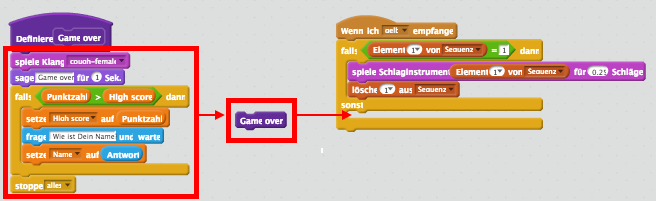
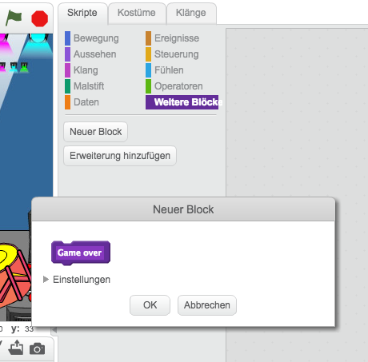
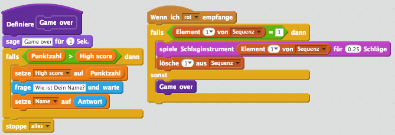
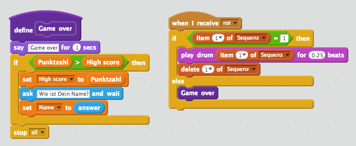
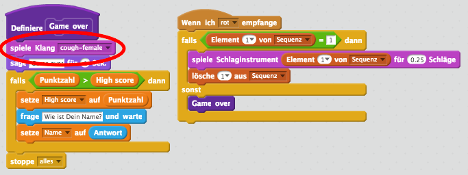

## Höchstpunktestand

Lass uns den Höchstpunktestand bzw. High score speichern, damit Du gegen Deine Freunde antreten kannst.

+ Füge Deinem Projekt die 2 neuen Variablen `High score`{:class="blockdata"} und `Name`{:class=".blockdata"} hinzu.

+ Wann immer das Spiel beendet wird (durch Drücken des falschen Knopfes), musst Du prüfen, ob das Ergebnis des Spielers höher ist als der aktuelle Höchstpunktestand. Ist dies der Fall, musst Du sowohl die Punktzahl des neuen High scores, als auch den Namen des Spielers speichern. So sollte der Code Deines roten Knopfes aussehen:

	```blocks
Wenn ich [rot v] empfange
falls <(Element (1 v) von [Sequenz v]) = [1]> dann
   lösche (1 v) aus [Sequenz v]
sonst
   sage [Game over!] für (1) Sek.
   falls <(Punktzahl) > (High score)> dann
      setze [High score v] auf (Punktzahl)
      frage [High score! Wie ist Dein Name?] und warte
      setze [Name v] auf (Antwort)
   Ende
   stoppe [alles v]
Ende
	```

+ Du musst diesen neuen Code zu den anderen 3 Tasten hinzufügen! Ist Dir aufgefallen, dass der 'Game over'-Code in jeder der vier Tasten genau der selbe ist?

	

+ Wenn Du jemals einen dieser Codes ändern musst, zum Beispiel um ein Geräusch hinzuzufügen oder die 'Game over'´-Nachricht zu ändern, müsstest Du ganze 4 Mal die gleiche Änderung vornehmen! Das könnte lästig werden und viel Zeit verschwenden.

+ Stattdessen kannst Du Deine eigenen Bausteine definieren, und diese in Deinem Projekt wiederverwenden! Um dies zu tun, klicke auf `Weitere Blöcke`{:class="blockmoreblocks"} und dann 'Neuer Block'. Benenne diesen neuen Block 'Game over'.

	

+ Füge den Code aus dem `sonst`{:class="blockcontrol"}-Block von der roten Taste zu dem neu erschienen Block hinzu:

	

+ Du hast nun eine neue _Funktion_ namens `Game over`{:class="blockmoreblocks"} erstellt, die Du überall verwenden kannst. Ziehe Deinen neuen `Game over`{:class="blockmoreblocks"}-Block auf die 4 Skripte der Tasten.

	

+ Füge als Nächstes ein Geräusch hinzu, wenn die falsche Taste gedrückt wird. Du musst diesen Code nur _einmal_ im `Game over`{:class="blockmoreblocks"}-Block hinzufügen, anstatt 4 Mal für jede einzelne Farbe! Praktisch, oder?

	
