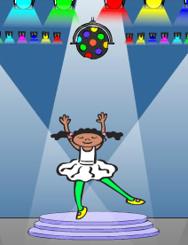

--- challenge ---
## Herausforderung: Ein weiteres Kostüm
Hast Du bemerkt, dass das Spiel damit beginnt, dass Dein Charakter eine der 4 Farben zeigt, und dass das Kostüm immer die letzte Farbe anzeigt, die in der Reihenfolge auftaucht, während der Spieler die Farben wiederholt?

Kannst Du dem Charakter ein anderes komplett weißes Kostüm geben, welches zu Beginn des Spiels angezeigt wird, und wenn der Spieler versucht, die Sequenz zu wiederholen?

--- /challenge ---
