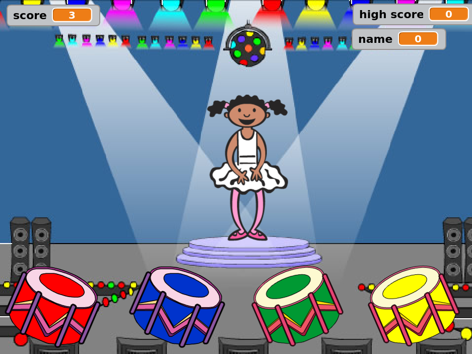

--- no-print ---

This is the **Scratch 2** version of the project. There is also a [Scratch 3 version of the project](https://projects.raspberrypi.org/en/projects/memory).

--- /no-print ---

## Introduction

In this project, you will create a memory game in which you have to memorise and repeat a random sequence of colours!

### What you will make

--- no-print ---
Click on the green flag to start. Watch the sequence of colours shown by the dancer's dress and listen to the accompanying drum beats, then repeat the colours back to her. If you get the colours' order wrong, it's game over!

    

<iframe allowtransparency="true" width="485" height="402" src="//scratch.mit.edu/projects/embed/258514878/?autostart=false" frameborder="0" allowfullscreen scrollbars="no"></iframe>

--- /no-print ---

--- print-only ---

--- /print-only ---

--- collapse ---
---
title: What you will learn
---
- How to add sound to your Scratch project
- How to create and use lists to store data
- How to create and use custom blocks for repeating code

--- /collapse ---

--- collapse ---
---
title: What you will need
---
### Hardware

+ A computer capable of running Scratch 2.0

### Software

Scratch 2.0 [offline](https://rpf.io/scratchoff){:target="_blank"}
--- /collapse ---

--- collapse ---
---
title: Additional information for educators
---

--- no-print ---

If you need to print this project, please use the [printer-friendly version](https://projects.raspberrypi.org/en/projects/memory-scratch2/print){:target="_blank"}.

--- /no-print ---

You can [download the completed project here](http://rpf.io/p/en/memory-scratch2-get).

--- /collapse ---
