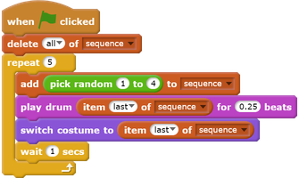

## Add sound

--- task ---
Test your project a few times. Do you notice that sometimes the same number is chosen twice (or more) in a row, which makes the sequence harder to memorise?

Can you make a drum sound play each time the character changes costume? How about a different drum sound depending on which colour is chosen? The code you need to do this is __very__ similar to the code to change the character's costume.

--- hints ---
--- hint ---
You only need to add two blocks: a `play drum for (0.25) beats`{:class="blocksound"} block and a `item (last) of sequence`{:class="blockdata"} block.
--- /hint ---
--- hint ---

Here are the blocks you need:

--- /hint ---

--- hint ---
Here is how your finished code should look:

--- /hint ---

--- /hints ---

--- /task ---
