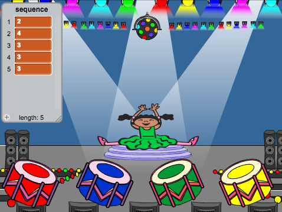

## Repeat the sequence

Now you're going to add four buttons the player has to press to repeat the colour sequence.

--- task ---
Add four new sprites to your project to represent the four buttons.
- Edit the new sprites' costumes so that there is one sprite in each of the four colours
- Put the sprites in the same order on the stage as the costumes: red, blue, green, yellow



--- /task ---

--- task ---

Add code to the red sprite so that, when the sprite is clicked, it `broadcasts`{:class="blockevents"} a 'red' message to the character sprite:


```blocks
	when this sprite clicked
	broadcast [red v]
```
--- /task ---

A `broadcast`{:class="blockevents"} is like a message announced over a loudspeaker, which you can for example hear in schools or supermarkets. All of the sprites can hear the `broadcast`{:class="blockevents"}, but only the sprite whose job it is to respond will do something.

--- task ---

Add similar code to the blue, green, and yellow sprites to make them `broadcast`{:class="blockevents"} messages about their own colour.

--- no-print ---

Here is an easy way to copy code from one sprite to another. Change the `broadcast`{:class="blockevents"} message of each sprite to match the colour of the sprite.


--- /no-print ---

--- print-only ---

You can duplicate a whole code script from one sprite to another by dragging the script from the Scripts area to the sprite in the Sprites Panel.

--- /print-only ---

--- /task ---

Do you remember that the `broadcast`{:class="blockevents"} is like a loudspeaker message? You will add code to make it the character sprite's job to respond to the `broadcast`{:class="blockevents"} messages.

--- task ---

When your character sprite receives the message `red`{:class="blockevents"}, the code should check whether the number `1` is at the start of the `sequence`{:class="blockdata"} list (which means that `red`{:class="blockevents"} is the next colour in the sequence).

If `1` is at the start of the list, the code should remove the number from the list, because the player remembered the correct colour. Otherwise it's game over, and the code needs to `stop all`{:class="blockcontrol"} to end the game.


```blocks
when I receive [red v]
if <(item (1 v) of [sequence v])=[1]> then
delete (1 v) of [sequence v]
else
say [Game over!] for (1) secs
stop [all v]
end
```
--- /task ---

--- task ---

Add to the code you just wrote so that a drum beat also plays when the character sprite receives the correct `broadcast`{:class="blockevents"}.

--- hints ---
--- hint ---
Can you use the numbers that correspond to each colour to play the correct drum beat?
+ 1 = red
+ 2 = blue
+ 3 = green
+ 4 = yellow
--- /hint ---
--- hint ---
Above the `delete 1 of sequence`{:class="blockdata"} block, add the `play drum`{:class="blocksound"} block to play the first sound in the `sequence`{:class="blockdata"} list.

--- /hint ---
--- hint ---
Here is the code you will need to add:

```blocks
play drum (item (1 v) of [sequence v]) for (0.25) beats
```
--- /hint ---
--- /hints ---

--- /task ---

--- task ---
+ Duplicate the code you used to make your character sprite respond to the message `red`{:class="blockevents"}. Change the duplicated code so that it sends the message `blue`{:class="blockevents"}.
--- /task ---

When the sprite responds to the message `blue`{:class="blockevents"}, which bit of code should stay the same, and which bit should change? Remember that each colour has a corresponding number.

--- task ---
Change the character sprite's code so that the character responds correctly to the `blue`{:class="blockevents"} message.

--- hints ---
--- hint ---

Keep these blocks, but you need to change them in some way:


```blocks
<(item (1 v) of [sequence v]) = [1]>

when I receive [red v]
```

--- /hint ---
--- hint ---
Here is how your code should look for the `blue`{:class="blockevents"} broadcast.


```blocks
when I receive [blue v]
if <(item (1 v) of [sequence v])=[2]> then
	play drum (item (1 v) of [sequence v]) for (0.25) beats
	delete (1 v) of [sequence v]
else
	say [Game over!] for (1) secs
	stop [all v]
end
```

--- /hint ---
--- /hints ---
--- /task ---

--- task ---
Duplicate the code again twice (for the green and yellow buttons), and change the necessary parts so that the character responds correctly to the new `broadcasts`{:class="blockevents"} .
--- /task ---

Remember to test the code! Can you memorise a sequence of five colours? Is the sequence different each time?

When the player repeats the whole colour sequence correctly, the `sequence`{:class="blockdata"} list emtpy and the player wins. If you want, you can also display some flashing lights as a reward once the `sequence`{:class="blockdata"} list is empty.

--- task ---
Add this code to the end of your character's `when flag clicked`{:class="blockevents"} script:


```blocks
	wait until < (length of [sequence v]) = [0]>
	broadcast [won v] and wait
```
--- /task ---

--- task ---
Switch to the Stage, and import the `drum machine` sound or another sound you like.

[[[generic-scratch-sound-from-library]]]

--- /task ---

--- task ---
Add this code to play a sound and make the backdrop change colour when the player wins.


```blocks
	when I receive [won v]
	play sound [drum machine v]
	repeat (50)
		change [color v] effect by (25)
		wait (0.1) secs
	end
	clear graphic effects
```
--- /task ---
