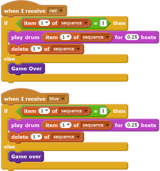

## Challenge: improve your game

### Make more blocks
Do you see any other code that is the same for all four buttons?

Can you make another custom block that all buttons can use?

### Another costume
Can you see that your game starts with your character showing one of the four colours, and that the character always displays the last colour in the sequence while the player is repeating the colour sequence?

Can you add another plain white costume to your character, and add code so that the character displays this costume at the start of the game and while the player is repeating the sequence?

### Difficulty level
Can you allow your player to choose between playing the game in 'easy mode' (using just the red and blue colours) and 'normal mode' (which uses all four colours)?

If you want, you can even add a 'hard' mode, which makes use of a fifth drum!
