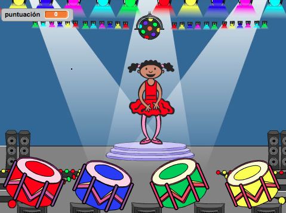

--- no-print ---

This is the **Scratch 2** version of the project. There is also a [Scratch 3 version of the project](https://projects.raspberrypi.org/es-ES/projects/memory).

--- /no-print ---

## Introducción

En este proyecto, ¡vas a crear un juego de memoria en el que tendrás que memorizar y repetir una secuencia de colores aleatoria!

  <iframe allowtransparency="true" width="485" height="402" src="https://scratch.mit.edu/projects/embed/34874510/?autostart=false" frameborder="0"></iframe>
  

## Recursos
Para este proyecto, se debería usar Scratch 2. Scratch 2 se puede utilizar online en [jumpto.cc/scratch-on](http://jumpto.cc/scratch-on), o se puede descargar desde [jumpto.cc/scratch-off](http://jumpto.cc/scratch-off) para usarlo offline.

La versión completa de este proyecto se puede encontrar <a href="http://scratch.mit.edu/projects/34874510/#editor">online</a>, o se puede descargar haciendo clic en el enlace 'Descargar Materiales del Proyecto' que se encuentra en este proyecto, y que contiene:

+ Memory.sb2

## Objetivos de aprendizaje
+ Listas;
+ Funciones sencillas.

## Retos
+ "Añadir sonido" - mejorar la usabilidad del juego;
+ "Crear 4 botones" - manipular listas;
+ "Crear más bloques" - crear bloques personalizados;
+ "Otro disfraz" - mejorar la usabilidad del juego;
+ "Nivel de dificultad" - modificar los datos almacenados en una lista.
