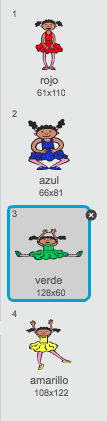
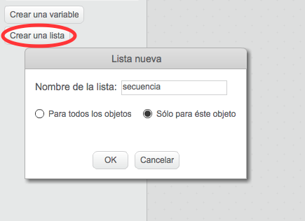
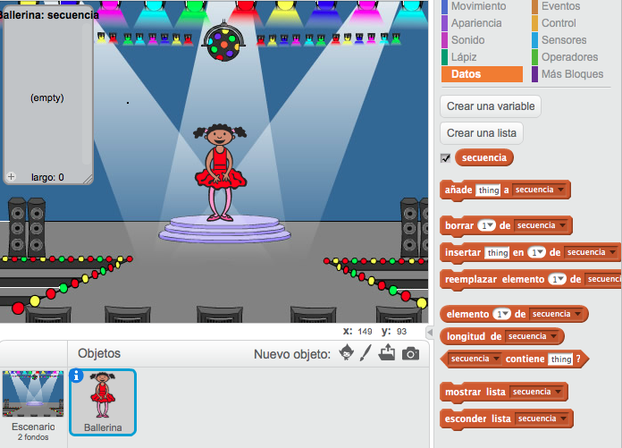

## Colores al azar

Para empezar, vamos a crear un personaje que pueda cambiar a una secuencia de colores al azar que el jugador tendrá que memorizar.

+ Crea un nuevo proyecto de Scratch, y borra el objeto gato para que el proyecto esté vacío. Puedes encontrar el editor online de Scratch en <a href="http://jumpto.cc/scratch-new">jumpto.cc/scratch-new</a>.

+ Escoge un personaje y un fondo. No es necesario que tu personaje sea una persona, pero tiene que poder cambiar de color.

	

+ En el juego, usarás un número diferente para representar cada color:

	+ 1 = rojo;
	+ 2 = azul;
	+ 3 = verde;
	+ 4 = amarillo.

	Da a tu personaje disfraces de 4 colores diferentes. Los colores tendrán que ser los indicados arriba. Asegúrate de que los colores de los disfraces están en el orden correcto.

	

+ Para crear una secuencia aleatoria, tendrás que crear una __lista__. Una lista es simplemente una variable que almacena una gran cantidad de datos __en orden__. Crea una nueva lista llamada `secuencia`{:class="blockdata"}. Como tu personaje es el único que necesita ver esta lista, también podemos seleccionar 'Sólo para este objeto'.

	

	A continuación, deberías ver una lista vacía en la parte superior izquierda del escenario, y un montón de bloques nuevos para usar listas.

	

+ Añade este código a tu personaje para añadir un número al azar a tu lista (y mostrar el disfraz correcto) 5 veces:

	```blocks
		al presionar bandera verde
		borrar (todos v) de [secuencia v]
		repetir (5)
			añade (número al azar entre (1) y (4)) a [secuencia v]
			cambiar disfraz a (elemento (último v) de [secuencia v])
			esperar (1) segundos
		fin
	```

	Fíjate que has vaciado la lista para empezar.
