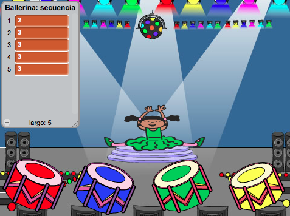

## Repite la secuencia

Vamos a añadir 4 botones para que el jugador pueda repetir la secuencia a recordar.

+ Añade 4 objetos al proyecto, que se convertirán en botones. Edita los 4 objetos para que haya 1 para cada uno de los 4 colores.

	

+ Al presionar el tambor rojo, tendrás que enviar un mensaje a tu personaje, diciéndole que se ha presionado el botón rojo. Añade este código al tambor rojo:

	```blocks
		al hacer clic en este objeto
		enviar [rojo v]
	```

+ Cuando tu personaje reciba este mensaje, tendrá que comprobar si el número 1 es el primero de la lista (esto significa que el rojo es el siguiente color en la secuencia). Si lo es, puedes eliminar el número de la lista, ya que el jugador ha acertado el color. Si no lo es, ¡se acabó el juego!.

	```blocks
		al recibir [rojo v]
		si <(elemento (1 v) de [secuencia v]) = [1]> entonces
   			borrar (1 v) de [secuencia v]
		si no
			decir [¡Fin del juego!] por (1) segundos
			detener [todos v]
		fin
	```

+ También podrías hacer que parpadeen luces cuando se haya vaciado la lista, ya que esto significa que el jugador ha acertado la secuencia entera. Añade este código al final del programa `al presionar bandera verde`{:class="blockevents"} de tu personaje:

	```blocks
		esperar hasta que <(longitud de [secuencia v]) = [0]>
		enviar [victoria v] y esperar
	```

+ Haz clic en el escenario y añade este código para que el fondo cambie de color cuando el jugador gane.

	```blocks
		al recibir [victoria v]
		tocar sonido [drum machine v]
		repetir (50)
			cambiar efecto [color v] por (25)
			esperar (0.1) segundos
		fin
		quitar efectos gráficos
	```

## Reto: Crear 4 botones 
Repite los pasos indicados arriba para los botones de color azul, verde y amarillo. ¿Qué código se quedará igual, y qué código tendrás que cambiar para cada botón?

También puedes hacer que se oigan sonidos al presionar los botones.

¡Recuerda probar el código que has añadido! ¿Puedes memorizar una secuencia de 5 colores? ¿Es la secuencia diferente cada vez?
