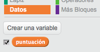

## Niveles múltiples

Hasta ahora, el jugador sólo tiene que memorizar 5 colores. Vamos a mejorar el juego, haciendo que la secuencia sea más larga.

+ Crea una nueva variable con el nombre `puntuación`{:class="blockdata"}.

	

+ Esta `puntuación`{:class="blockdata"} se usará para decidir la duración de la secuencia que el jugador tiene que memorizar. Para empezar, la puntuación (y la duración de la secuencia) es 3. Añade el siguiente bloque al principio del código `al presionar bandera verde`{:class="blockevents"} de tu personaje:

	```blocks
		fijar [puntuación v] a [3]
	```

+ Ahora, en lugar de crear una secuencia de 5 colores, haremos que la `puntuación`{:class="blockdata"} determine la duración de la secuencia. Cambia el bucle `repetir`{:class="blockcontrol"} (para crear la secuencia) a:

	```blocks
		repetir (puntuación)
		fin
	```

+ Si el jugador acierta la secuencia, deberías añadir 1 a la puntuación para aumentar la duración de la secuencia.

	```blocks
		cambiar [puntuación v] por (1)
	```

+ Para acabar, tienes que añadir un bucle `por siempre`{:class="blockcontrol"} alrededor del código para generar la secuencia, y así se creará una nueva secuencia para cada nivel. El código de tu personaje debería ser así:

	```blocks
		al presionar bandera verde
		fijar [puntuación v] a [3]
		por siempre
   			borrar (todos v) de [secuencia v]
			repetir (puntuación)
				añade (número al azar entre (1) y (4)) a [secuencia v]
				cambiar disfraz a (elemento (último v) de [secuencia v])
				esperar (1) segundos
			fin
			esperar hasta que <(longitud de [secuencia v]) = [0]>
			enviar [victoria v] y esperar
			cambiar [puntuación v] por (1)
		fin
	```

+ Haz que tus amigos prueben el juego. ¡Recuerda esconder la lista `secuencia`{:class="blockdata"} antes de que jueguen!
