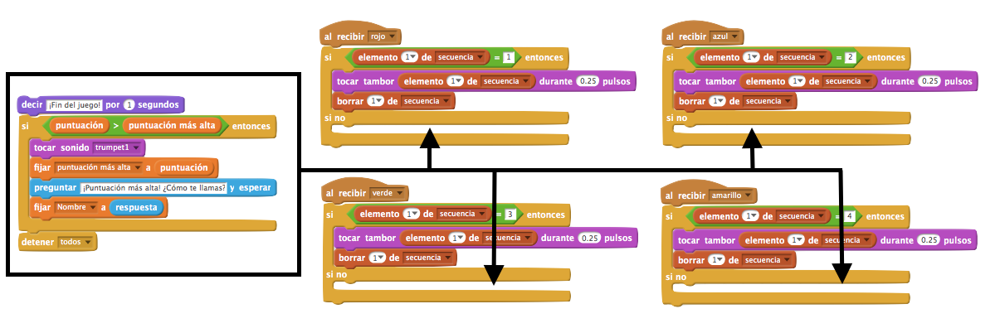
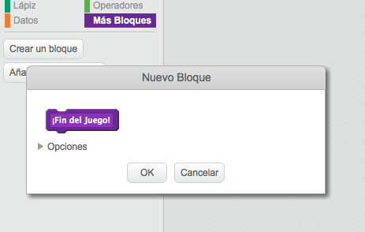
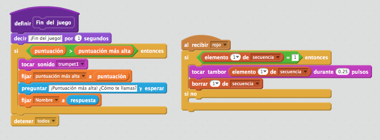
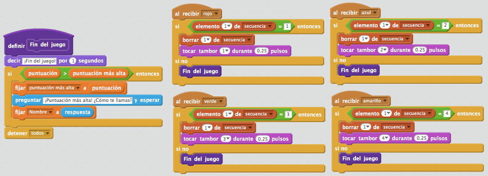
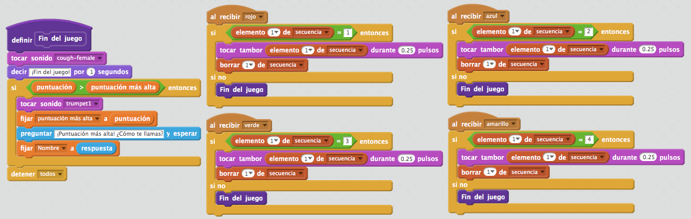

## Puntuación más alta

Vamos a hacer que se guarde la puntuación más alta, para que puedas competir con tus amigos.

+ Añade 2 nuevas variables a tu proyecto con los nombres `puntuación más alta`{:class="blockdata"} y `nombre`{:class="blockdata"}.

+ Si se acaba el juego (al presionar el botón equivocado), tendrás que comprobar si la puntuación del jugador es mayor que la puntuación más alta actual. Si lo es, tienes que guardar esa puntuación como la puntuación más alta y hacer que se guarde el nombre del jugador. El botón rojo debería ser así:

	```blocks
		al recibir [rojo v]
		si <(elemento (1 v) de [secuencia v]) = [1]> entonces
			borrar (1 v) de [secuencia v]
		si no
			decir [¡Fin del juego!] por (1) segundos
			si <(puntuación) > (puntuación más alta)> entonces
				fijar [puntuación más alta v] a (puntuación)
				preguntar [¡Puntuación más alta! ¿Cómo te llamas?] y esperar
				fijar [nombre v] a (respuesta)
			fin
			detener [todos v]
		fin
	```

+ ¡Tendrás que añadir este nuevo código a los otros 3 botones también! ¿Te has dado cuenta de que el código de 'Fin del Juego' en los 4 botones es exactamente el mismo?

	

+ Si alguna vez tuvieras que cambiar algo de este código, como añadir un sonido o cambiar el mensaje de '¡Fin del Juego!', ¡tendrías que cambiarlo 4 veces! Eso sería muy pesado y te llevaría mucho tiempo.

	En lugar de hacer eso, ¡puedes definir tus propios bloques y reusarlos en tu proyecto! Para hacer esto, presiona `más bloques`{:class="blockmoreblocks"}, y a continuación 'Crear un bloque'. Llama a este nuevo bloque 'Fin del Juego'.

	

+ Añade el código del bloque `si no`{:class="blockcontrol"} del botón rojo al nuevo bloque que aparece:

	

+ Acabas de crear una nueva _función_ llamada `Fin del Juego`{:class="blockmoreblocks"}, que podrás usar siempre que quieras. Arrastra tu nuevo bloque de `Fin del Juego`{:class="blockmoreblocks"} hasta los 4 programas de los botones.

	

+ Ahora añade un sonido para cuando el jugador aprieta el botón equivocado. ¡Sólo tienes que añadir este código _una vez_ en el bloque de `Fin del Juego`{:class="blockmoreblocks"} que has creado, en lugar de 4 veces!

	
