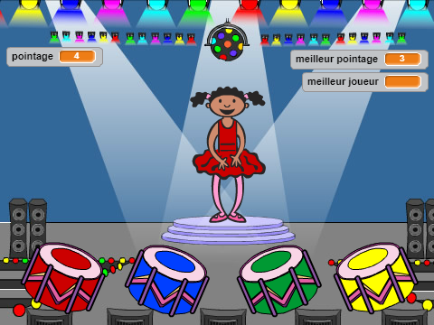

--- no-print ---

This is the **Scratch 2** version of the project. There is also a [Scratch 3 version of the project](https://projects.raspberrypi.org/fr-FR/projects/memory).

--- /no-print ---

## Introduction

Dans ce projet, vous allez créer un jeu de mémoire où vous devez mémoriser et répéter une séquence aléatoire de couleurs!

  <iframe allowtransparency="true" width="485" height="402" src="https://scratch.mit.edu/projects/embed/172305882/?autostart=false" frameborder="0"></iframe>
  

## Ressources
Pour ce projet, on devrait utiliser Scratch 2. Scratch 2 peut être utilisé soit en ligne via [jumpto.cc/scratch-on](http://jumpto.cc/scratch-on) ou en téléchargeant à partir de [jumpto.cc/scratch-off](http://jumpto.cc/scratch-off) pour une utilisation hors-connexion.

Vous trouverez une version finalisée du projet <a href="https://scratch.mit.edu/projects/172305882/#editor">en ligne</a>, ou vous pouvez la télécharger en cliquant sur le lien 'Matériaux du Projet' qui contient :

+ Memory.sb2

## Objectifs d’apprentissage
+ Listes;
+ Des fonctions simples.

Ce projet couvre des éléments des parcours suivants du cursus de créativité numérique [Raspberry Pi Digital Making Curriculum](http://rpf.io/curriculum):

+ [Combiner des structures de programmation afin de résoudre des problèmes.](https://www.raspberrypi.org/curriculum/programming/builder)

## Défis
+ "Ajouter du son" - améliorer la simplicité d'utilisation du jeu;
+ "Créer 4 boutons" - manipuler des listes;
+ "Créer d'autres blocs" - créer des blocs personnalisés;
+ "Un autre costume" - améliorer la simplicité d'utilisation du jeu;
+ "Niveau de difficulté" - modifier les données stockées dans une liste.
