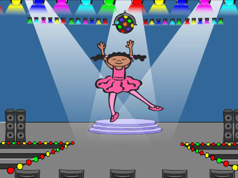
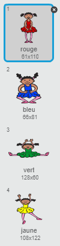
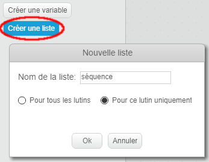
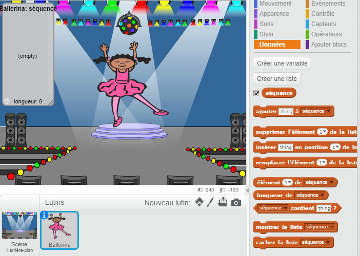

## Des couleurs aléatoires

Créons un personnage qui peut se transformer dans une séquence aléatoire de couleurs à mémoriser par le joueur.

+ Démarrez avec un nouveau projet Scratch et supprimez le lutin de chat pour commencer un projet vide. L'éditeur scratch se trouve en ligne à <a href="http://jumpto.cc/scratch-new" target="_blank">jumpto.cc/scratch-new</a>.

+ Choisissez un lutin et un arrière-plan. Votre personnage n'a pas besoin d'être un humain, mais doit pouvoir changer de couleur.

	

+ Dans votre jeu, vous allez utiliser un chiffre différent pour représenter chaque couleur :

	+ 1 = rouge;
	+ 2 = bleu;
	+ 3 = vert;
	+ 4 = jaune.

	Donnez à votre personnage 4 costumes de couleurs différentes, un pour chacune des 4 couleurs ci-dessus. Vérifiez le bon ordre de vos costumes.

	

+ Pour créer une séquence aléatoire, vous avez besoin de créer une __liste__. Une liste est simplement une variable qui stocke des données _dans un certain ordre_. Créez une nouvelle liste nommée `séquence`{:class="blockdata"}. Seul votre personnage a besoin de voir la liste, donc nous pouvons choisir 'Pour ce lutin uniquement'.

	

	Votre liste vide devrait apparaître en haut à gauche de votre scène, ainsi que plusieurs nouveaux blocs à utiliser avec des listes.

	

+ Ajoutez ce code à votre personnage afin d'ajouter un chiffre aléatoire à votre liste (et montrer le bon costume) 5 fois :

	```blocks
    quand le drapeau vert pressé
    supprimer l'élément (tout v) de la liste [séquence v]
    répéter (5) fois
       ajouter (nombre aléatoire entre (1) et (4)) à [séquence v]
       basculer sur le costume (élément (last v) de [séquence v] :: list)
       attendre (1) secondes
    fin
	```

	Vous pouvez remarquer que vous avez aussi vidé la liste avant de commencer.
