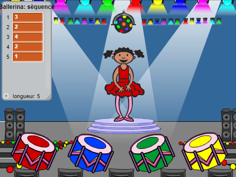

## Répéter la séquence

Ajoutons 4 boutons pour que le joueur puisse répéter la séquence mémorisée.

+ Ajoutez 4 lutins qui vont devenir des boutons. Modifiez vos 4 lutins pour qu'il y en ait un de chaque couleur.

	

+ Quand on clique sur le tambour rouge, il faut envoyer le message à votre personnage pour faire savoir que le bouton rouge a été cliqué. Ajoutez ce code à votre tambour rouge :

	```blocks
    quand ce lutin est cliqué
    envoyer à tous [rouge v]
	```

+ Quand votre personnage reçoit ce message, il doit vérifier si le chiffre 1 est au début de la liste (ce qui veut dire que rouge est la prochaine couleur dans la séquence). Si tout correspond, c'est que la réponse est bonne. Sinon, c'est "Partie terminée!"

	```blocks
    quand je reçois [rouge v]
    si <(élément (1 v) de [séquence v]) = [1]> alors
       supprimer l'élément (1 v) de la liste [séquence v]
    sinon
       dire [Partie terminée!] pendant (1) secondes
       stop [tout v]
    fin
	```

+ Vous pouvez aussi faire clignoter des lumières lorsque la liste sera vide, ce qui signifie que vous avez bien deviné la séquence entière. Ajoutez ce code à la fin du texte `quand ⚑ cliqué`{:class="blockevents"} de votre personnage :

	```blocks
    attendre jusqu’à <(longueur de [séquence v]) = [0]>
    envoyer à tous [gagné v] et attendre
	```

+ Cliquez sur votre scène et ajoutez ce code pour jouer __n'importe quel__ son et faire changer la couleur du fond lorsque le joueur a gagné la partie.

	```blocks
    quand je reçois [gagné v]
    jouer le son [drum machine v]
    répéter (50) fois
       ajouter à l'effet [couleur v] (25)
       attendre (0.1) secondes
    fin
    annuler les effets graphiques
	```

## Défi : Créer 4 boutons 
Répétez les étapes ci-dessus pour vos boutons bleus, verts et jaunes. Quel code restera pareil et quel code faudrait-il modifier pour chaque bouton?

Vous pouvez aussi ajouter des sons lorsque vous appuyez sur les boutons.

N'oubliez pas de tester le code que vous venez d'ajouter! Pouvez-vous mémoriser une séquence de 5 couleurs? Est-ce que la séquence change à chaque fois?
