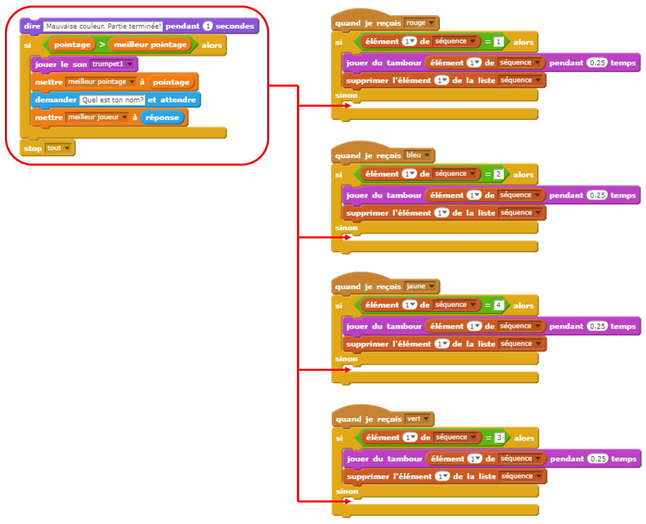
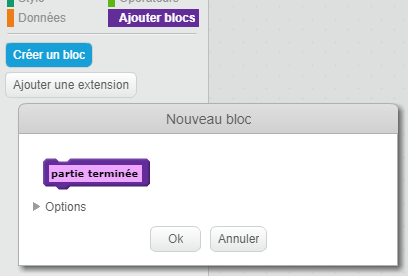
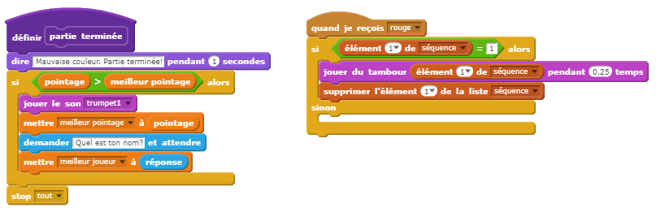
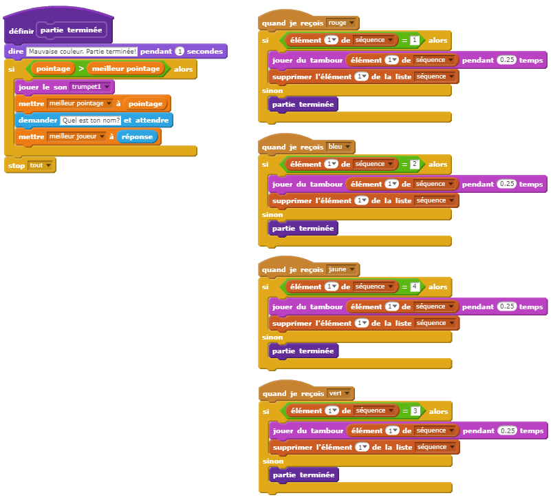
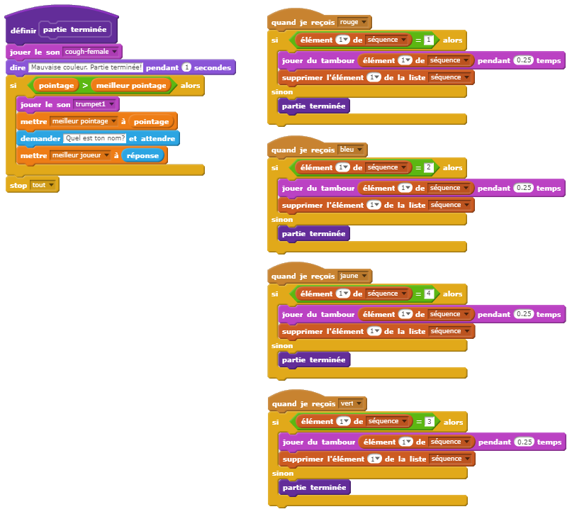

## Meilleur pointage

Ajoutons la possibilité d'enregistrer le meilleur pointage afin de pouvoir jouer contre vos amis.

+ Ajoutez 2 nouvelles variables à votre projet nommées `meilleur pointage`{:class="blockdata"} et `meilleur joueur`{:class="blockdata"}.

+ Si jamais le jeu s'arrête (en appuyant sur le mauvais bouton), vous aurez besoin de vérifier si le pointage du joueur est plus grand que le meilleur pointage actuel. Si c'est le cas, vous devez enregistrer le pointage comme le nouveau meilleur pointage et enregistrer le nom du joueur. Voici à quoi devrait correspondre votre bouton rouge :

	```blocks
    quand je reçois [rouge v]
    si <(élément (1 v) de [séquence v]) = [1]> alors
       supprimer l'élément (1 v) de la liste [séquence v]
    sinon
       dire [Partie terminée!] pendant (1) secondes
       si <(pointage) > (meilleur pointage)> alors
          mettre [meilleur pointage v] à (pointage)
          demander [Meilleur pointage! Quel est ton nom?] et attendre
          mettre [meilleur joueur v] à (réponse)
       fin
       stop [tout v]
    fin
	```

+ Vous aurez besoin d'ajouter ce nouveau code aux 3 autres boutons aussi! Avez-vous remarqué que le code 'Partie terminée' est identique pour chacun des 4 boutons?

	

+ Si jamais vous changez une partie du code, comme pour ajouter un son ou changer le message 'Partie terminée!', vous allez devoir le changer 4 fois! Ça devient embêtant et vous perdez beaucoup de temps.

	À la place, vous pouvez définir vos propres blocs afin de les réutiliser dans votre projet! Pour faire cela, cliquez `Ajouter blocs`{:class="blockmoreblocks"} et puis sur 'Créer un bloc'. Nommez ce nouveau bloc 'Partie terminée'.

	

+ Ajoutez le code du bloc `sinon`{:class="blockcontrol"} du bouton rouge au nouveau bloc que vous voyez :

	

+ Vous avez maintenant créé une nouvelle _fonction_ appelée `Partie terminée`{:class="blockmoreblocks"} que vous pouvez utiliser où vous voulez. Glissez votre nouveau bloc `Partie terminée`{:class="blockmoreblocks"} vers les 4 scripts pour les boutons.

	

+ Ensuite, ajoutez un son lorsque vous cliquez sur le mauvais bouton. Vous avez juste à ajouter ce code _une fois_ dans le bloc `Partie terminée`{:class="blockmoreblocks"} que vous venez de créer, et non à 4 occasions différentes!

	
