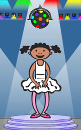

--- challenge ---
## Défi : Un autre costume 

Avez-vous remarqué que votre jeu démarre avec votre personnage montrant une des 4 couleurs et qu'il affiche toujours la dernière couleur de la séquence pendant que le joueur répète la séquence?

Pouvez-vous ajouter un costume blanc qui sera affiché sur votre lutin au début de la partie, ainsi que lorsque le joueur tente de copier la séquence?

--- /challenge ---
