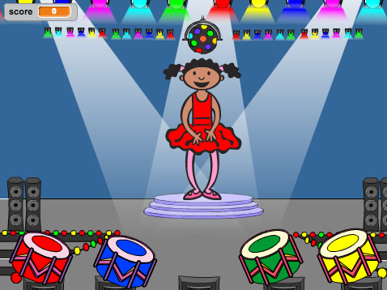

--- no-print ---

This is the **Scratch 2** version of the project. There is also a [Scratch 3 version of the project](https://projects.raspberrypi.org/hi-IN/projects/memory).

--- /no-print ---

## भूमिका

इस प्रोजेक्ट में, आप मेमोरी गेम बनाएँगे जिसमें आप रंगों के बेतरतीब अनुक्रम को याद रखेंगे और दोहराएँगे!

### आप क्या बनाएँगे

शुरू करने के लिए, हरे फ्लैग पर क्लिक करें। नर्तकी की पोशाक द्वारा दिखाए गए रंगों का अनुक्रम देखें और उसके साथ में बजता ड्रम सुनें, फिर उन्हें उसके लिए दोहराएं। यदि आप गलत अनुक्रम देते हैं, तो गेम समाप्त हो जाता है!

  <iframe allowtransparency="true" width="485" height="402" src="https://scratch.mit.edu/projects/embed/34874510/?autostart=false" frameborder="0"></iframe>
  

### आप क्या सीखेंगे

यह प्रोजेक्ट [Raspberry Pi डिजिटल निर्माण पाठ्यचर्या](http://rpf.io/curriculum){:target="_blank"} में से निम्नलिखित गुणों के तत्वों को कवर करता है:

+ [समस्या का हल करने के लिए प्रोग्रामिंग निर्माण का संयोजन करें।](https://www.raspberrypi.org/curriculum/programming/builder){:target="_blank"}

### शिक्षकों के लिए अतिरिक्त जानकारी

यदि आपको यह प्रोजेक्ट प्रिंट करना हो, कृपया [प्रिंटर के अनुकूल संस्करण](https://projects.raspberrypi.org/en/projects/memory-scratch2/print){:target="_blank"} का उपयोग करें।

इस प्रोजेक्ट के लिए GitHub रेपो का उपयोग करने के लिए फुटर में दिए लिंक का उपयोग करें, जिसमें 'en/resources' फोल्डर में सभी संसाधन (तैयार प्रोजेक्ट के उदाहरण सहित) शामिल हैं।
