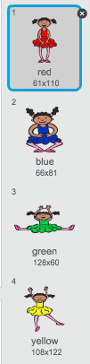
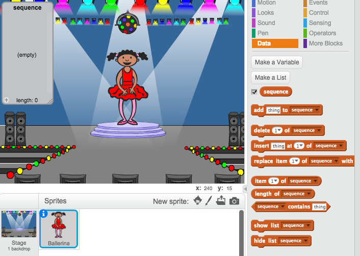

## रंगों का अनुक्रम बनाएँ

पहले, पात्र बनाएँ जो याद रखने के लिए रंगों का अनुक्रम प्रदर्शित करेगा।

+ नया Scratch प्रोजेक्ट प्रारंभ करें, और कैट स्प्राइट हटाएं, ताकि आपका प्रोजेक्ट खाली हो। आप [यहाँ](http://jumpto.cc/scratch-new) ऑनलाइन Scratch एडिटर देख सकते हैं।

+ पात्र स्प्राइट और बैकड्रॉप चुनें। यह आवश्यक नहीं है कि आपका पात्र मनुष्य हो, परन्तु उन्हें भिन्न-भिन्न रंग प्रदर्शित करने में सक्षम होना चाहिए।


+ अपने गेम में, आप प्रत्येक रंग को प्रदर्शित करने के लिए, भिन्न संख्या का उपयोग करेंगे:

	+ 1 = लाल
	+ 2 = नीला
	+ 3 = हरा
	+ 4 = पीला

	अपने पात्र को उपर्युक्त चार रंगों में से, प्रत्येक के लिए एक भिन्न रंग की पोशाक दें। सुनिश्चित करें कि आपकी रंगीन पोशाकें उपर्युक्त सूची के समान क्रम में हैं।

	

चलिए रंगों का बेतरतीब अनुक्रम बनाएँ।

+ `क्रम`{:class="blockdata"} नामक सूची बनाएँ। हम इस सूची का उपयोग रंगों के उस अनुक्रम को स्टोर करने के लिए करेंगे, जो खिलाड़ी को याद रखना होगा। केवल पात्र स्प्राइट को सूची देखने की आवश्यकता होगी, इसलिए आप **For this sprite only** (केवल इस स्प्राइट के लिए) चुन सकते हैं।

[[[generic-scratch-make-list]]]

अब आपको अपनी स्टेज के बाईं ओर खाली सूची, और साथ ही सूची का उपयोग करने के लिए कई नए ब्लॉक दिखने चाहिए।



+ क्या आपको याद है कि हमने प्रत्येक रंग को एक संख्या दी है? हम बेतरतीब संख्या चुनकर और सूची में जोड़कर बेतरतीब रंग चुन सकते हैं। इस कोड को जोड़ें:

```blocks
जब ⚑ क्लिक किया गया हो
((1) से (4) तक क्रमरहित चुनने) से [क्रम v] जोङें
```

+ हरे फ्लैग पर क्लिक करके अपने कोड का परीक्षण करें। यह देख लें कि आप जब भी इस पर क्लिक करते हैं, तो सूची में 1 और 4 के बीच की बेतरतीब संख्या शामिल हो जाती है।

+ क्या आप एक साथ पाँच बेतरतीब रंग बनाने के लिए, अपने प्रोग्राम में इस ब्लॉक को जोड़ सकते हैं?

```blocks
(5) बार दोहराएं
end

end
```

+ आपने शायद ध्यान दिया होगा कि अब आपकी सूची अब भर रही है। इससे पहले कि हम कोई संख्या बनाएँ, चलिए आरंभ करने पर पूरी सूची को मिटाने के लिए, ब्लॉक जोड़ें।

```blocks
जब ⚑ क्लिक किया गया हो
(सब v) का [क्रम v] मिटा दे

(5) बार दोहराएं
end
	((1) से (4) तक क्रमरहित चुनने) से [क्रम v] जोङें
end
```

+ अंत में, हर समय जब हम संख्या चुनते हैं, चलिए नृतक की पोशाक को सूची में अंत में शामिल अंतिम आइटम से बदलते हैं, जो वही संख्या होगी, जिसे हमने अभी-अभी चुना है। सूची में बेतरतीब संख्या जोड़ने के तुरंत बाद, इन ब्लॉक को अपने कोड में जोड़ें:

```blocks
पोशाक बदल कर ((last v) की [क्रम v] चीज) करें
(1) सेकेंड तक ठहरे
```
