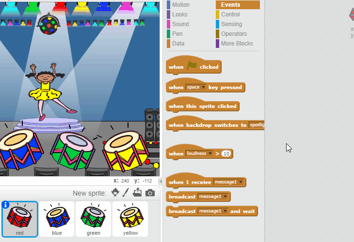

## अनुक्रम दोहराना

चलिए खिलाड़ी को याद आने वाला अनुक्रम दोहराने के लिए, चार बटन जोड़ें जिन्हें उसे दबाना होगा।

+ चार बटनों का प्रतिनिधित्व करने के लिए अपने प्रोजेक्ट में चार नए स्प्राइट जोड़ें। पोशाकों को संपादित करें ताकि चार रंगों में से प्रत्येक में स्प्राइट मौजूद हो। पोशाक के क्रम के समान स्प्राइट बनाएँ — लाल, नीले, हरे, पीले।


+ जब लाल ड्रम पर क्लिक किया जाता है, तो आपको अपने पात्र के लिए संदेश प्रसारित करना होगा, उन्हें बताना होगा कि लाल बटन पर क्लिक किया गया है। इस कोड को अपने लाल ड्रम में जोड़ें:

```blocks
	इस स्प्राईट को क्लिक करने पर
	[लाल v] प्रसारण करें
```

प्रसारण एक प्रकार की लाउडस्पीकर पर की गई घोषणा जैसा होता है — आपको यह शायद यह सुपरमार्किट में शॉपिंग करने के दौरान सुनाई दिया होगा। सभी स्प्राइट्स इस संदेश को सुन सकती हैं, परन्तु केवल वह स्प्राइट ही कुछ करेगी, जिसे प्रत्युत्तर करनी है।

+ नीले, हरे और पीले ड्रम में समान कोड जोड़ें, ताकि वे अपने स्वयं के रंगों के बारे में संदेश प्रसारित कर सकें।

--- hints ---
--- hint ---
एक स्प्राइट से दूसरी पर कोड कॉपी करने का आसान तरीका इस प्रकार है। स्प्राइट के रंग के साथ मिलान करने के लिए, प्रत्येक स्प्राइट में प्रसारित संदेश में परिवर्तन करें।

--- /hint ---
--- /hints ---

क्या आपको याद है, हमने कहा था कि प्रसारण एक प्रकार की लाउडस्पीकर पर की गई घोषणा जैसा होता है? केवल वह स्प्राइट ही कुछ करेगी, जिसे प्रत्युत्तर करनी है, तो चलिए पात्र की स्प्राइट से संदेश पर प्रत्युत्तर करवाएँ। हम ऐसा पात्र के लिए कुछ कोड लिखकर करते हैं, जब उन्हें प्रत्येक संदेश सुनाई देता है।

 + जब आपके पात्र की स्प्राइट को `लाल` संदेश प्राप्त होता है, तो कोड को यह जाँचना चाहिए कि क्या संख्या `1` सूची के आरंभ में है (जिसका अर्थ है कि अनुक्रम में अगला रंग `लाल` है)।

 यदि हाँ, तो कोड को सूची में से संख्या को हटा देना चाहिए, क्योंकि रंग का अनुमान सही था। अन्यथा गेम समाप्त हो जाता है, और हमें गेम को रोकने के लिए `रोक दे [सब]`{:class="blockcontrol"} करना होगा।

```blocks
	मुझे [red v] मिलने पर
अगर <(item (1 v) of [sequence v] :: list) = [1]> हो तो 
  (1 v) का [sequence v] मिटा दे

  [Game over!] सेकंड तक (1) बोले
  रोक दे [सब v]
end
```

+ हाल ही में आपके द्वारा लिखे कोड में जोड़ें, ताकि सही रंग प्राप्त होने पर ड्रम की बीट भी बजे।

--- hints ---
--- hint ---
क्या आप उन संख्याओं का उपयोग कर सकते हैं, जो ड्रम की सही बीट बजाने के लिए प्रत्येक रंग के अनुरूप है?
+ 1 = लाल
+ 2 = नीला
+ 3 = हरा
+ 4 = पीला
--- /hint ---
--- hint ---
`क्रम का 1 हटाएँ`{:class="blockdata"} से पहले आपको अनुक्रम की सूची में पहली ध्वनि बजाने के लिए `ढोल बजाएँ`{:class="blocksound"} ब्लॉक जोड़ना होगा:


--- /hint ---
--- hint ---
यह वह कोड है, जिसकी आपको जोड़ने के लिए आवश्यकता होगी:

```blocks
((1 v) की [sequence v] चीज :: list) ढोल (0.25) ताल तक बजाएँ
```
--- /hint ---
--- /hints ---

+ `लाल` संदेश पर प्रत्युत्तर के लिए अपने पात्र की स्प्राइट के लिए आपने जिस कोड उपयोग किया था, उसकी नकल बनाएँ। इस बार, संदेश को `नीला` से बदल दें।

जब स्प्राइट `नीला` संदेश पर प्रत्युत्तर करती है, कोड का कौन सा टुकड़ा समान रहना चाहिए, और कौन से टुकड़े में परिवर्तन होना चाहिए? यह याद रखें कि प्रत्येक रंग के अनुरूप एक संख्या है।

+ अपने कोड में परिवर्तन करें, ताकि पात्र `नीला` संदेश पर सही प्रत्युत्तर दे।

--- hints ---
--- hint ---
इन ब्लॉक को बनाए रखें, परन्तु आपको उन्हें किसी तरीके से बदलना होगा:

--- /hint ---
--- hint ---
नीले प्रसारण के लिए आपका कोड कुछ इस प्रकार दिखाई देना चाहिए।

```blocks
	मुझे [blue v] मिलने पर
अगर <(item (1 v) of [sequence v] :: list) = [2]> हो तो 
  ((1 v) की [sequence v] चीज :: list) ढोल (0.25) ताल तक बजाएँ
  (1 v) का [sequence v] मिटा दे

  [Game over!] सेकंड तक (1) बोले
  रोक दे [सब v]
end
```

--- /hint ---
--- /hints ---

+ हरे और पीले बटनों के लिए कोड की दो और बार नकल बनाएँ, और आवश्यक भागों में परिवर्तन करें ताकि पात्र उचित रूप से प्रत्युत्तर करे।

+ आपके द्वारा शामिल किए गए कोड का परीक्षण करना याद रखें! क्या आप पाँच रंगों का अनुक्रम याद रख सकते हैं? क्या अनुक्रम हर बार भिन्न होता है?

आप सूची के खाली होने पर पुरस्कार के रूप में चमकती लाइट्स प्रदर्शित कर सकते हैं, क्योंकि इसका अर्थ होगा कि पूरे अनुक्रम को सही ढंग से याद रखा गया था।

+ अपने पात्र की `जब ⚑ क्लिक किया गया हो`{:class="blockevents"} स्क्रिप्ट के अंत में यह कोड जोड़ें:

```blocks
	<([क्रम v] की लंबाई) = [0]> होने तक ठहरे
	[won v] प्रसारण करें अौर रुके
```

+ स्टेज पर स्विच करें, और खिलाड़ी के जीत जाने पर ध्वनि बजाने और बैकड्रॉप का रंग बदलने के लिए यह कोड जोड़ें। आप अपनी पसंद की कोई भी ध्वनि चुन सकते हैं।

```blocks
	मुझे [won v] मिलने पर
[drum machine v] ध्वनि बजाएँ
(50) बार दोहराएं 
  [रंग v] से (25) प्रभाव बदले
  (0.1) सेकेंड तक ठहरे
end
ग्राफ़िक प्रभाव मिटा दे
```
