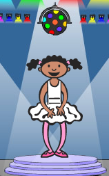

--- challenge ---
## चुनौती: अन्य पोशाक
क्या आपने ध्यान दिया है कि आपका गेम चार रंगों में से एक दर्शाने वाले पात्र के साथ आरंभ होता है, और खिलाड़ी द्वारा अनुक्रम दोहराने के दौरान वे हमेशा अनुक्रम में अंतिम रंग प्रदर्शित करते हैं?

क्या आप अपने पात्र के लिए अन्य सादी सफेद पोशाक जोड़ सकते हैं, जो आपकी गेम के आरंभ में, और तब दिखाई देती है, जब खिलाड़ी अनुक्रम की नकल करने का प्रयास करता है?

--- /challenge ---
