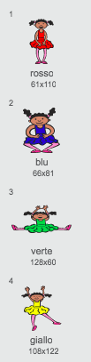
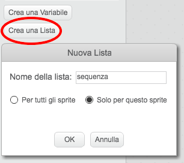
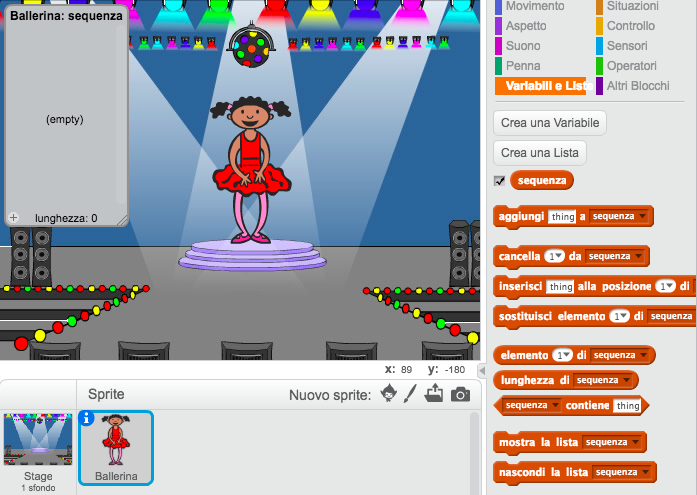

## Colori a caso

Per prima cosa, creiamo un personaggio che può cambiare in una sequenza di colori che il giocatore deve memorizzare.

+ Inizia un nuovo progetto Scratch, e cancella lo sprite del gatto così che il tuo progetto sia vuoto. Puoi trovare l'editore Scratch online a <a href="http://jumpto.cc/scratch-new" target="_blank">jumpto.cc/scratch-new</a>.

+ Scegli un personaggio e uno scenario. Il tuo personaggio non deve essere una persona, ma deve essere in grado di mostrare colori diversi.

	

+ Nel tuo gioco, userai un numero diverso per rappresentare ciascun colore.

	+ 1 = rosso;
	+ 2 = blu;
	+ 3 = verde;
	+ 4 = giallo;

	Dai al tuo personaggio 4 costumi colorati diversi, uno per ciascuno dei 4 colori qui sopra. Assicurati che i tuoi costumi colorati siano nell'ordine giusto.

	

+ Per creare una sequenza a caso, dovrai creare una __lista__. Una lista è solo una variabile che immagazzina tanti dati __in ordine__. Crea una nuova lista chiamata `sequenza`{:class="blockdata"}. Dato che solo il tuo personaggio ha bisogno di vedere la lista, possiamo anche cliccare 'Solo per questo sprite'.

	

	Ora vedrai la tua lista vuota in alto a sinistra del quadro, così come tanti nuovi blocchi per usare le liste.

	

+ Aggiungi questo codice al tuo personaggio per aggiungere un numero a caso alla tua lista (e mostrare il costume corretto) 5 volte:

	```blocks
		quando si clicca sulla bandiera verde
		cancella (tutto v) da [sequenza v]
		ripeti (5) volte
  			aggiungi (numero a caso tra (1) e (4)) a [sequenza v]
  			passa al costume (elemento (last v) di [sequenza v] :: list)
  			attendi (1) secondi
		end
	```

	Nota che hai innanzitutto svuotato la lista.
