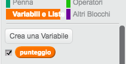

## Livelli multipli

Fino ad ora, il giocatore deve ricordare solo 5 colori. Miglioriamo il tuo gioco in modo che la lunghezza della sequenza aumenti.

+ Crea una nuova variabile chiamata `punteggio`{:class="blockdata"}.

	

+ Questo `punteggio`{:class="blockdata"} verrà usato per decidere la lunghezza della sequenza che il giocatore deve memorizzare.  Dunque, fin dall'inizio il punteggio (e la lunghezza della sequenza) è 3. Aggiungi questo codice all'inizio del codice `quando si clicca la bandiera`{:class="blockevents"}:

	```blocks
		porta [punteggio v] a [3]
	```

Invece di creare sempre una sequenza di 5 colori, ora vuoi che il `punteggio`{:class="blockdata"} determini la lunghezza della sequenza. Cambia il loop `ripeti`{:class="blockcontrol"} del tuo personaggio (per creare la sequenza) a:

```blocks
  ripeti (punteggio) volte
  end
```

+ Se si indovina la sequenza correttamente, dovrai aggiungere 1 al punteggio per aumentare la lunghezza della sequenza.

	```blocks
		cambia [punteggio v] di (1)
	```

+ Infine, dovrai aggiungere un loop `per sempre`{:class="blockcontrol"} attorno al codice per generare la sequenza, in modo che venga creata una nuova sequenza per ogni livello. Il codice del tuo personaggio dovrebbe essere così:

	```blocks
		quando si clicca sulla bandiera verde
		porta [punteggio v] a [3]
		per sempre
  			cancella (tutto v) da [sequenza v]
  			ripeti (score) volte
    			aggiungi (numero a caso tra (1) e (4)) a [sequenza v]
    			passa al costume (elemento (ultimo v) di [sequenza v] :: list)
    			attendi (1) secondi
  			end
  			attendi fino a quando <(length of [sequenza v] :: list) = [0]>
  			invia a tutti [won v] e attendi
  			cambia [punteggio v] di (1)
		end
	```

+ Fai provare il gioco ai tuoi amici. Ricordati di nascondere la lista `sequenza`{:class="blockdata"} prima che inizino a giocare!
