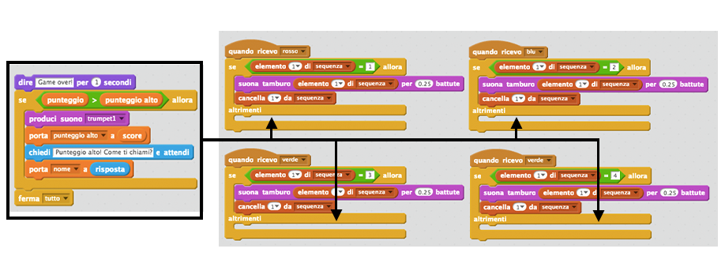
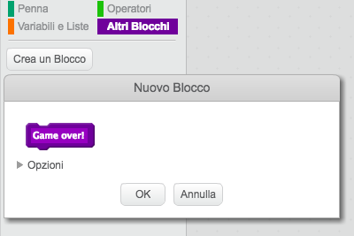
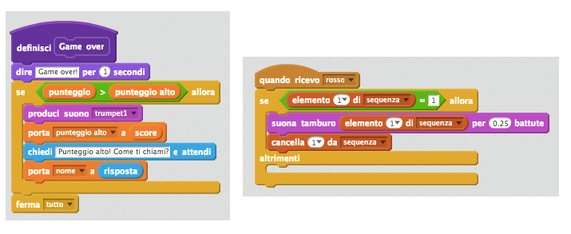
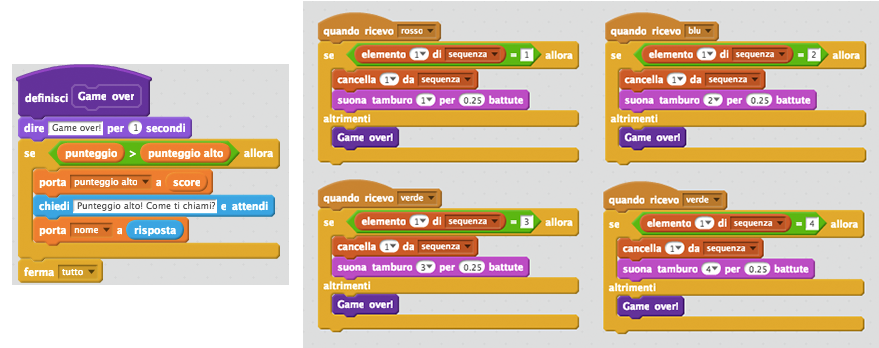
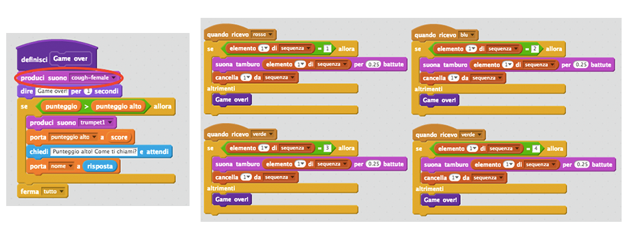

## Punteggio alto

Salviamo il punteggio alto, in modo che tu possa giocare contro i tuoi amici.

+ Aggiungi al progetto 2 nuovi variabili chiamate `punteggio alto`{:class="blockdata"} e `nome`{:class="blockdata"}.

+ Se il gioco dovesse finire (premendo il tasto sbagliato), dovrai controllare se il punteggio del giocatore è più alto del punteggio massimo attuale. Se lo è, dovrai salvare il punteggio come punteggio alto, e salvare il nome del giocatore. Il tuo tasto rosso sarà così:

	```blocks
		quando ricevo [rosso v]
		se <(item (1 v) of [sequenza v] :: list) = [1]> allora
  			cancella (1 v) da [sequenza v]
		altrimenti
  			dire [Game over!] per (1) secondi
  			se <(punteggio) > (punteggio alto)> allora
    			porta [punteggio alto v] a (punteggio)
    			chiedi [Punteggio alto! Come ti chiami?] e attendi
    			porta [nome v] a (risposta)
  			end
  			ferma [tutto v]
		end
	```

+ Dovrai aggiungere questo nuovo codice anche agli altri 3 tasti! hai notato che il codice 'Game over' è esattamente lo stesso in ognuno dei 4 tasti?

	

+ Se dovessi avere bisogno di cambiare qualsiasi cosa di questo codice, come aggiungere un suono o cambiare il messaggio 'Game over!', dovrai cambiarlo 4 volte! Ciò potrebbe essere fastidioso e risultare in una perdita di tempo.

	Invece, puoi definire i tuoi blocchi e riutilizzarli nel tuo progetto! Per fare ciò, clicca `Altri Blocchi`{:class="blockmoreblocks"}, e poi 'Crea un Blocco'. Chiama questo nuovo blocco 'Game over'.

	

+ Aggiungi questo codice dal blocco `altrimenti`{:class="blockcontrol"} dal tasto rosso fino al nuovo blocco che compare:

	

+ Ora hai creato ora una nuova _funzione_ chiamata `Game over`{:class="blockmoreblocks"}, che puoi usare ogni volta che vorrai. Trascina il tuo nuovo blocco `Game over`{:class="blockmoreblocks"} sulle 4 scritte dei tasti.

	

+ Adesso aggiungi un suono per quando viene premuto il tasto sbagliato. Questo codice dovrà essere aggiunto_una volta_ nel blocco `Game over`{:class="blockmoreblocks"} che hai creato, e non 4 volte separate!

	
