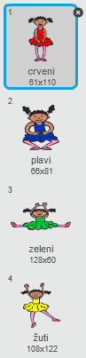
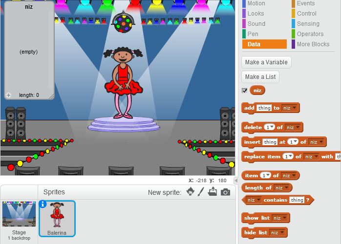

## Napravi niz boja

Kreirajmo prvo karaktera koji će prikazivati slučajan niz boja koji treba da bude zapamćen.

+ Započni novi Scratch projekat i izbriši lik mačke tako da tvoj projekat bude prazan. Online Scratch editor možeš naći [ovdje](http://jumpto.cc/scratch-new).

+ Izaberi lik (sprite) karaktera i pozadinu (backdrop). Tvoj karakter ne mora da bude osoba, ali mora da bude sposoban da pokazuje različite boje.


+ U svojoj igri koristićeš brojeve koji će predstavljati pojedine boje:
    
    + 1 = crvena
    + 2 = plava
    + 3 = zelena
    + 4 = žuta
    
    Daj svom karakteru četiri kostima (costumes) različitih boja, po jedan za svaku od navedenih boja. Pobrini se da tvoji obojeni kostimi budu poređani isto kao boje u gore navedenom spisku.
    
    
    
    Možeš da koristiš alat *color a shape* (oboji oblik) da dijelove kostima obojiš drugom bojom.

Kreirajmo slučajan niz boja.

+ Kreiraj listu (list) pod nazivom `niz`{:class="blockdata"}. Ovu listu koristićemo da u nju smjestimo niz boja koji igrač treba da zapamti. Samo lik karaktera treba da vidi listu, tako da možeš da izabereš **For this sprite only** (Samo za ovaj lik).

[[[generic-scratch-make-list]]]

Sada bi trebalo da vidiš svoju praznu listu u gornjem lijevom uglu pozornice, kao i mnogo novih blokova za korišćenje listi.



+ Da li se sjećaš da smo svakoj boji dodijelili broj? Slučajnu boju možemo da izaberemo tako što ćemo izabrati slučajan broj i dodati ga u listu. Dodaj ovaj kôd:

```blocks
when flag clicked
add (pick random (1) to (4)) to [niz v]
```

+ Klikni na zelenu zastavicu i isprobaj svoj kôd. Provjeri da li se u listu dodaje slučajan broj od 1 do 4 svaki put kada klikneš na zastavicu.

+ Da li u svoj program možeš da dodaš ovaj blok tako da se odjednom stvori pet slučajnih boja?

```blocks
repeat (5)

end
```

+ Možda primjećuješ da se tvoja lista već prilično napunila. Dodajmo blok da na početku izbrišemo cijelu listu, prije dodavanja brojeva.

```blocks
when flag clicked
delete (all v) of [niz v]
repeat (5)
    add (pick random (1) to (4)) to [niz v]
end
```

+ Na kraju, svaki put kada izaberemo broj, promijenimo kostim balerine u poslednji elemenat dodat u listu, a to je broj koji smo upravo izabrali. Dodaj ove blokove svom kôdu, odmah posle bloka kojim se dodaje slučajan broj u listu:

```blocks
switch costume to (item (last v) of [niz v])
wait (1) secs
```