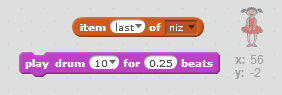

--- challenge ---

## Izazov: dodavanje zvuka

Isprobaj svoj projekat nekoliko puta. Možeš primijetiti da je ponekad isti broj izabran dva (ili više) puta zaredom, zbog čega je teže zapamtiti niz. Da li možeš da napraviš da se čuje zvuk bubnja svaki put kada karakter promijeni kostim?

Možeš li da napraviš da se čuje različit zvuk bubnja zavisno od toga koji je broj izabran? Ovaj kôd će biti *veoma* sličan tvom kôdu za promjenu kostima karaktera.

--- hints --- --- hint --- Ovaj izazov možeš da riješiš tako što ćeš dodati samo dva bloka postojećem kôdu svog karaktera! --- /hint --- --- hint --- Ovo su blokovi koji će ti biti potrebni:

 --- /hint ---

--- hint --- Ovako bi trebalo da izgleda završen kôd:

```blocks
when flag clicked
delete (all v) of [niz v]
repeat (5)
    add (pick random (1) to (4)) to [niz v]
    play drum (item (last v) of [niz v]) for (0.25) beats
    switch costume to (item (last v) of [niz v])
    wait (1) secs
end
```

--- /hint ---

--- /hints ---

--- /challenge ---