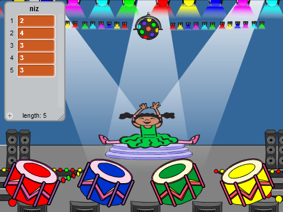
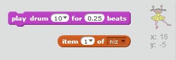
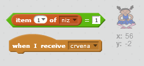

## Ponavljanje niza

Dodajmo četiri dugmeta koja igrač treba da pritisne da bi ponovio niz koji je zapamtio.

+ U svoj projekat dodaj četiri nova lika (sprites) koji će predstavljati četiri dugmeta. Uredi kostime (costumes) tako da svaki od likova bude u jednoj od četiri boje. Poređaj likove istim redosledom kao kostime — crvena, plava, zelena, žuta.



+ Kada se klikne na crveni bubanj, treba da pošalješ poruku svom karakteru, tako da on zna da je kliknuto na crveno dugme. Dodaj ovaj kôd svom crvenom bubnju:

```blocks
    when this sprite clicked
    broadcast [crvena v]
```

Slanje poruke pomalo liči na obavještavanje preko zvučnika — možda si to čuo/čula tokom kupovine u supremarketu. Svi likovi mogu da čuju poruku, ali samo lik čiji je zadatak da odgovori će nešto učiniti.

+ Dodaj slične kôdove plavom, zelenom i žutom bubnju, kako bi poslali poruke o svojoj boji.

--- hints --- --- hint --- Ovdje je jednostavan način da se kopira kôd iz jednog lika u drugi. Promijeni poruku u svakom liku tako da odgovara boji tog lika.  --- /hint --- --- /hints ---

Sjećaš li se da smo rekli da slanje poruke pomalo liči na obavještavanje preko zvučnika? Samo lik čiji je zadatak da odgovori će nešto učiniti, pa hajde da napravimo da zadatak lika karaktera bude da odgovori na poruke. To ćemo učiniti tako što ćemo napisati kôd koji će reći karakteru šta da uradi kada čuje svaku od poruka.

+ Kada lik tvog karaktera primi poruku `crvena`, kôd treba da provjeri da li je broj `1` na početku liste (što znači da je `crvena` sljedeća boja u nizu).
    
    Ako je tako, kôd treba da ukloni broj sa liste, pošto je boja ispravno pogođena. U suprotnom, igra je završena i treba da `zaustavimo sve`{:class="blockcontrol"} (stop all) kako bismo zaustavili igru.

```blocks
    when I receive [crvena v]
    if <(item (1 v) of [niz v])=[1]> then
        delete (1 v) of [niz v]
    else
        say [Kraj igre!] for (1) secs
        stop [all v]
    end
```

+ Dodaj upravo napisanom kôdu da se, takođe, čuje zvuk bubnja kada se dobije ispravna boja.

--- hints --- --- hint --- Da li možeš da koristiš brojeve koji odgovaraju svakoj od boja kako bi svirao ispravan zvuk bubnja?

+ 1 = crvena
+ 2 = plava
+ 3 = zelena
+ 4 = žuta --- /hint --- --- hint --- Treba da dodaš blok `play drum`{:class="blocksound"} (bubnjaj) da svira prvi zvuk u nizu prije `delete 1 of sequence`{:class="blockdata"} (obriši 1 iz niza):

 --- /hint --- --- hint --- Ovdje je kôd koji treba da dodaš:

```blocks
play drum (item (1 v) of [niz v]) for (0.25) beats
```

--- /hint --- --- /hints ---

+ Umnoži (duplicate) kôd koji si koristio/koristila da napraviš da lik tvog karaktera odgovori na poruku `crvena`. Ovaj put izmijeni poruku u `plava`.

Kada lik odgovori na poruku `plava`, koji dio kôda treba da ostane isti, a koji da se izmijeni? Sjeti se da svaka boja ima odgovarajući broj.

+ Izmijeni svoj kôd tako da karakter odgovara ispravno na poruku `plava`.

--- hints --- --- hint --- Koristi ove blokove, ali biće potrebno da ih na neki način izmijeniš:  --- /hint --- --- hint --- Ovako bi trebalo da izgleda tvoj kôd za odgovor na poruku 'plava'.

```blocks
    when I receive [plava v]
    if <(item (1 v) of [niz v])=[2]> then
        play drum (item (1 v) of [niz v]) for (0.25) beats
        delete (1 v) of [niz v]
    else
        say [Kraj igre!] for (1) secs
        stop [all v]
    end
```

--- /hint --- --- /hints ---

+ Još dva puta umnoži (duplicate) kôd za zeleno i žuto dugme i promijeni potrebne dijelove tako da karakter odgovara ispravno.

+ Ne zaboravi da isprobaš dodati kôd! Da li možeš da zapamtiš niz od pet boja? Da li je niz svaki put drugačiji?

Takođe možeš da prikažeš nekoliko svjetlećih lampica kao nagradu kada se lista isprazni, pošto to znači da je cijeli niz tačno zapamćen.

+ Dodaj ovaj kôd na kraj skripte tvog karaktera `when flag clicked`{:class="blockevents"} (kada je kliknuto na zastavicu):

```blocks
    wait until < (length of [niz v]) = [0]>
    broadcast [pobjeda v] and wait
```

+ Pređi na pozornicu (stage) i dodaj ovaj kôd da zasvira zvuk i da pozadina promijeni boju kada igrač pobijedi. Možeš da izabereš bilo koji zvuk koji ti se sviđa.

```blocks
    when I receive [pobjeda v]
    play sound [drum machine v]
    repeat (50)
        change [color v] effect by (25)
        wait (0.1) secs
    end
    clear graphic effects
```