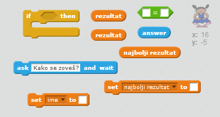
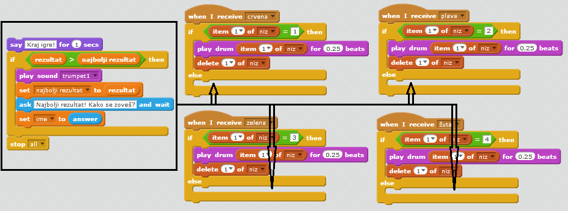
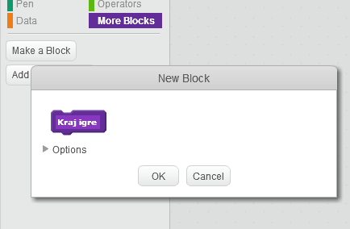
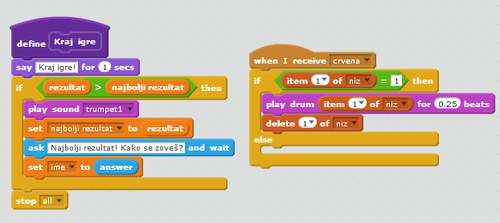
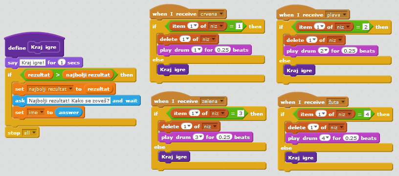
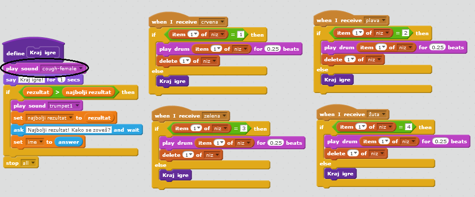

## Najbolji rezultat

Sačuvajmo najbolji rezultat, tako da možeš da igraš protiv svojih prijatelja.

+ Dodaj dvije nove promjenljive (variables) u svoj projekat i nazovi ih `najbolji rezultat`{:class="blockdata"} i `ime`{:class="blockdata"}.

Kada se igra završi zato što igrač nije tačno pogodio niz, treba da provjeriš da li je igračev rezultat veći od trenutnog najboljeg rezultata. Ako jeste, treba da sačuvaš igračev rezultat kao najbolji i da upišeš ime igrača.

+ Dodaj kôd liku karaktera da sačuva najbolji rezultat. Takođe, pitaj igrača za ime i upiši ga u promjenljivu `ime`{:class="blockdata"}.

[[[generic-scratch-high-score]]]

--- hints --- --- hint --- Tvoj novi kôd treba da prati ovu logiku: Nakon poruke `Kraj igre` `Ako je` (if) `rezultat` `veći od ` `najboljeg rezultata` `Postavi` (set) da `najbolji rezultat` bude `rezultat` `Pitaj` (ask) igrača kako se zove `Postavi` (set) da `ime` bude `odgovor` (answer) --- /hint --- --- hint --- Biće ti potrebni sljedeći blokovi:



--- /hint --- --- hint --- Ovako treba da izgleda tvoj kôd kada je pritisnuto crveno dugme:

```blocks
    when I receive [crvena v]
    if <(item (1 v) of [niz v])=[1]> then
        delete (1 v) of [niz v]
    else
        say [Kraj igre!] for (1) secs
        if < (rezultat) > (najbolji rezultat) > then
            set [najbolji rezultat v] to (rezultat)
            ask [Najbolji rezultat! Kako se zoveš?] and wait
            set [ime v] to (answer)
        end
        stop [all v]
    end
```

--- /hint --- --- /hints ---

+ Treba da dodaš ovaj novi kôd liku karaktera i za ostale tri boje! Da li primjećuješ da je kôd 'Kraj igre' potpuno isti za sve četiri boje?



Ako nekad bude potrebno da napraviš izmjene u ovom kôdu, na primjer da dodaš zvuk ili da izmijeniš poruku 'Kraj igre', moraćeš to uraditi četiri puta. To je dosadno i oduzima previše vremena.

Umjesto toga, možeš da definišeš sopstvene blokove i da ih koristiš više puta u svom projektu. Da to uradiš, klikni na `More blocks`{:class="blockmoreblocks"} (Više blokova), a zatim na **Make a block** (Napravi blok). Ovom novom bloku daj naziv 'Kraj igre'.



+ Bloku koji si kreirao/kreirala dodaj kôd iz bloka `else`{:class="blockcontrol"} (inače) povezanog sa crvenim dugmetom:



+ Sada si napravio/napravila novu *funkciju* pod nazivom `Kraj igre`{:class="blockmoreblocks"} koju možeš koristiti gdje god želiš. Prevuci svoj novi blok `Kraj igre`{:class="blockmoreblocks"} u četiri skripte za dugmad.



+ Sada dodaj zvuk koji će se čuti kada se pritisne pogrešno dugme. Ovaj kôd treba da dodaš samo jednom u blok `Kraj igre`{:class="blockmoreblocks"} koji si napravio/napravila, a ne četiri puta!


