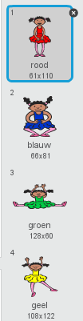
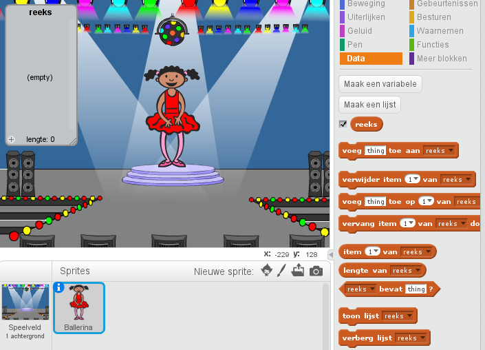

## Maak een kleurenreeks

Laten we een personage maken die een willekeurige reeks kleuren laat zien om te onthouden.

+ Start een nieuw Scratch-project en verwijder de kat-sprite zodat je project leeg is. Je kunt de online Scratch-editor [hier](http://jumpto.cc/scratch-new) vinden.

+ Kies een sprite en een achtergrond. Je personage hoeft geen persoon te zijn, maar moet verschillende kleuren kunnen weergeven.


+ In je game gebruik je verschillende getallen om elke kleur weer te geven:
    
    + 1 = rood
    + 2 = blauw
    + 3 = groen
    + 4 = geel
    
    Geef je personage vier verschillend gekleurde uiterlijken, een voor elk van de vier kleuren hierboven. Zorg ervoor dat de gekleurde uiterlijken in dezelfde volgorde staan ​​als in bovenstaande lijst.
    
    

We gaan nu een willekeurige reeks kleuren maken.

+ Maak een lijst met de naam `reeks`{:class="blockdata"}. In deze lijst bewaren we de kleurenreeks die de speler moet gaan onthouden. Alleen de sprite van de personage gebruikt deze lijst, dus kun je **Alleen voor deze sprite** selecteren.

[[[generic-scratch-make-list]]]

Je zou nu een lege lijst moeten zien, links in het speelveld, plus nieuwe blokken om met lijsten te kunnen werken.



+ Weet je nog dat we elke kleur een nummer hebben gegeven? We kunnen nu met een willekeurig getal een kleur selecteren en aan de lijst toevoegen. Voeg deze code toe:

```blocks
wanneer groene vlag wordt aangeklikt
voeg (willekeurig getal tussen (1) en (4)) toe aan [reeks v]
```

+ Test de code door op de groene vlag te klikken. Kijk of er een willekeurig getal tussen 1 en 4 aan de lijst wordt toegevoegd als je klikt.

+ Kun je dit blok toevoegen aan je programma om in één keer vijf willekeurige kleuren te genereren?

```blocks
herhaal (5) keer
end
```

+ Je merkt dat de lijst vol raakt. We gaan een blok toevoegen om de hele lijst te wissen voordat er getallen worden gegenereerd.

```blocks
wanneer groene vlag wordt aangeklikt
verwijder item (alle v) van [reeks v]
herhaal (5) keer 
  voeg (willekeurig getal tussen (1) en (4)) toe aan [reeks v]
end
```

+ Tot slot veranderen we het uiterlijk van de danser, door het item te gebruiken dat het laatst aan de lijst is toegevoegd, en dat is het nummer dat zojuist willekeurig is gekozen. Voeg deze blokken toe aan je programma, net nadat het willekeurige nummer aan je lijst is toegevoegd:

```blocks
verander uiterlijk naar (item (laaste v) van [reeks v] :: list)
wacht (1) sec.
```
