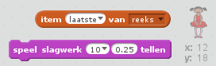

--- challenge ---

## Uitdaging: een geluid toevoegen

Test je project een paar keer. Je merkt misschien dat bepaalde getallen twee keer (of meer) voorkomen en dat maakt het lastiger om de reeks te onthouden. Kun je een trommelgeluid laten horen als het personage van uiterlijk verandert?

Kun je verschillende trommelgeluiden laten horen, afhankelijk van het getal dat is gemaakt? Dit lijkt *behoorlijk veel* op de code die je gebruikt om uiterlijken te veranderen.

--- hints --- --- hint --- Je kunt deze uitdaging voltooien door twee blokken aan je programma toe te voegen! --- /hint --- --- hint --- Dit zijn de blokken die je nodig hebt:

 --- /hint ---

--- hint --- Zo zou het voltooide programma eruit moeten zien:

```blocks
wanneer groene vlag wordt aangeklikt
verwijder item (alle v) van [reeks v]
herhaal (5) keer 
  voeg (willekeurig getal tussen (1) en (4)) toe aan [reeks v]
  speel slagwerk (item (laatste v) van [reeks v] :: list) (0.25) tellen
  verander uiterlijk naar (item (laatste v) van [reeks v] :: list)
  wacht (1) sec.
end
```

--- /hint ---

--- /hints ---

--- /challenge ---