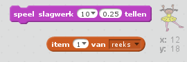

## Herhaal de reeks

We gaan vier drukknoppen toevoegen zodat de speler de onthouden reeks kan herhalen.

+ Voeg vier nieuwe sprites toe aan je project voor de vier knoppen. Bewerk het uiterlijk van elke sprite in een van de vier kleuren. Zet de sprites in dezelfde volgorde als de uiterlijken - rood, blauw, groen en geel.


+ Als op de rode trommel is geklikt moet er een signaal naar het personage worden gestuurd, zodat die weet dat op de rode knop is geklikt. Voeg deze code toe aan de rode trommel:

```blocks
    wanneer op deze sprite wordt geklikt
    zend signaal [rood v]
```

Een signaal zenden is alsof je een aankondiging hoort uit een luidspreker - zoals je misschien wel eens in de supermarkt hebt gehoord. Alle sprites kunnen de aankondiging horen, maar alleen de sprite die iets moet doen reageert erop.

+ Geef de blauwe, groene en gele trommels vergelijkbare code zodat ze een signaal kunnen zenden over hun eigen kleur.

--- hints --- --- hint --- Hier is een makkelijke manier om code van de ene sprite naar de andere te kopiëren. Verander het signaal in elke sprite om die te laten overeenkomen met zijn kleur.  --- /hint --- --- /hints ---

Weet je nog dat een signaal zenden een beetje lijkt op een aankondiging via een luidspreker? Alleen de sprite die moet antwoorden gaat iets doen, dus gaan we nu de sprite van het personage laten reageren op de signalen. Dat doen we door code te schrijven voor het personage zodat die weet wat er bij elk signaal moet gebeuren.

+ Als het personage een signaal `rood` krijgt moet het programma controleren of het getal `1` aan het begin van de lijst staat (wat betekent dat `rood` de volgende kleur in de reeks is).
    
    Als dat zo is moet het getal worden verwijderd omdat de kleur goed is. Zo niet, dan is het spel afgelopen en moet het blok `stop alle`{:class="blockcontrol"} het programma stoppen.

```blocks
    wanneer ik signaal [rood v] ontvang
als <(item (1 v) of [reeks v] :: list) = [1]> dan 
  verwijder item (1 v) van [reeks v]

  zeg [Game over!] (1) sec.
  stop [alle v]
end
```

+ Aan de code die je zojuist hebt geschreven kun je toevoegen dat er ook een trommelgeluid te horen is als de goede kleur is ontvangen.

--- hints --- --- hint --- Kun je de getallen gebruiken die overeenkomen met elke kleur om de juiste trommelgeluiden af te spelen?

+ 1 = rood
+ 2 = blauw
+ 3 = groen
+ 4 = geel --- /hint --- --- hint --- Je hebt een `speel slagwerk`{:class="blocksound"} blok nodig om het eerste geluid in de reeks af te spelen vóór `verwijder item 1 van reeks`{:class="blockdata"}:

 --- /hint --- --- hint --- Dit is de code die je moet toevoegen:

```blocks
speel slagwerk (item (1 v) van [reeks v] :: list) (0.25) tellen
```

--- /hint --- --- /hints ---

+ Maak een kopie van de code die je hebt gemaakt om het personage te laten reageren op `rood`. Deze keer wijzig je het signaal naar `blauw`.

Welke stukje code kan hetzelfde blijven als de sprite reageert op het signaal `blauw` en welke code zou moeten veranderen? Bedenk dat elke kleur een overeenkomend getal heeft.

+ Wijzig de code zodat het personage correct reageert op het signaal `blauw`.

--- hints --- --- hint --- Bewaar deze blokken, maar verander ze wat:  --- /hint --- --- hint --- Zo zou je code eruit moeten zien voor het blauwe signaal.

```blocks
    wanneer ik signaal [blauw v] ontvang
als <(item (1 v) of [reeks v] :: list) = [2]> dan 
  speel slagwerk (item (1 v) van [reeks v] :: list) (0.25) tellen
  verwijder item (1 v) van [reeks v]

  zeg [Game over!] (1) sec.
  stop [alle v]
end
```

--- /hint --- --- /hints ---

+ Kopieer de code nog twee keer voor de groene en gele knoppen en verander sommige onderdelen zodat het personage correct reageert.

+ Vergeet niet de toegevoegde code te testen! Kun je een reeks van 5 kleuren onthouden? Is de reeks steeds anders?

Je kunt ook als beloning een aantal lampjes laten knipperen zodra de lijst leeg is, want dat betekent dat de hele reeks correct is onthouden.

+ Voeg deze code toe aan het eind van het blok van het personage met `wanneer groene vlag wordt aangeklikt`{:class="blockevents"}:

```blocks
    wacht tot <(length of [reeks v] :: list) = [0]>
zend signaal [gewonnen v] en wacht
```

+ Ga naar het speelveld en voeg deze code toe om een geluid af te spelen en de achtergrond van kleur te laten veranderen als de speler heeft gewonnen. Je mag elk geluid kiezen.

```blocks
    wanneer ik signaal [gewonnen v] ontvang
start geluid [drum machine v]
herhaal (50) keer 
  verander [kleur v] -effect met (25)
  wacht (0.1) sec.
end
zet alle effecten uit
```
