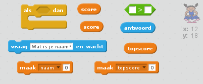
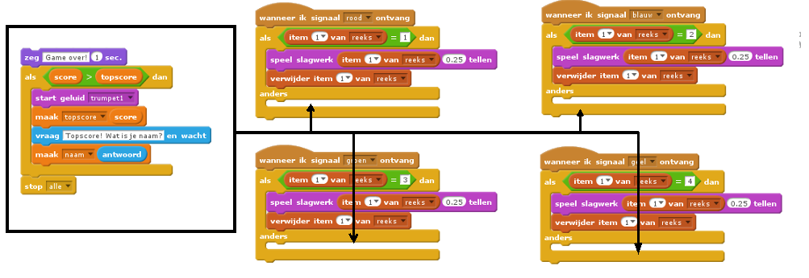
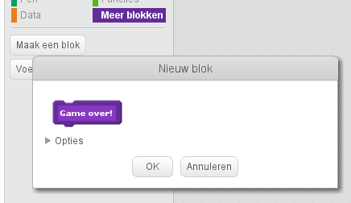
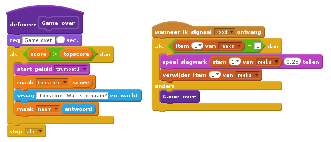
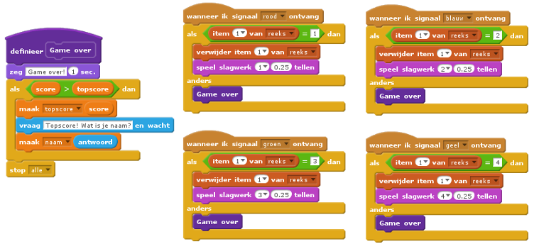
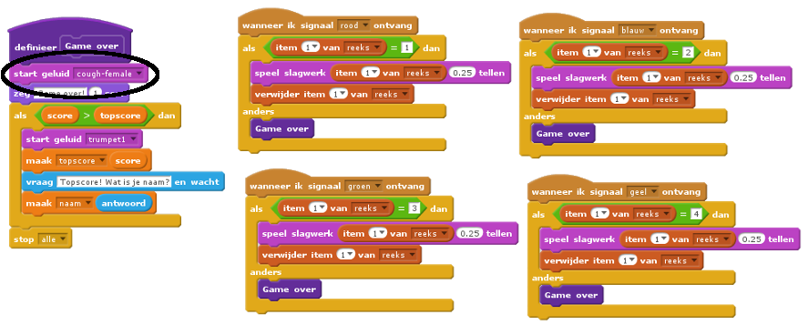

## Topscore

Laten we de topscore opslaan, zodat je tegen je vrienden kunt spelen.

+ Voeg twee nieuwe variabelen toe met de naam `topscore`{:class="blockdata"} en `naam`{:class="blockdata"}.

Als het spel stopt omdat de speler de reeks verkeerd heeft, moet je controleren of hun score hoger is dan de huidige topscore. Als dat zo is, moet je de score opslaan als topscore en de naam van de speler opslaan.

+ Voeg code toe aan de sprite van het personage om de topscore op te slaan. Vraag ook de naam van de speler en zet die in de `naam`{:class="blockdata"} variabele.

[[[generic-scratch-high-score]]]

--- hints --- --- hint --- Je nieuwe code heeft de volgende logica: Na het bericht `Game over` `Als` `score` is `groter dan` de `topscore` `Maak` de `topscore` de `score` `Vraag` de naam van de speler `Maak` `naam` het `antwoord` --- /hint --- --- hint --- Je hebt de volgende blokken nodig:



--- /hint --- --- hint --- Zo zou de code eruit moeten zien voor als op de rode knop is gedrukt:

```blocks
    wanneer ik signaal [rood v] ontvang
als <(item (1 v) of [reeks v] :: list) = [1]> dan 
  verwijder item (1 v) van [reeks v]

  zeg [Game over!] (1) sec.
  als <(score) > (topscore)> dan 
    maak [topscore v] (score)
    vraag [Topscore! Wat is je naam?] en wacht
    maak [naam v] (antwoord)
  end
  stop [alle v]
end
```

--- /hint --- --- /hints ---

+ Deze nieuwe code moet je voor de andere drie kleuren ook toevoegen aan de sprite van het personage! Zie je dat de code met 'Game over' bij alle kleuren hetzelfde is?



Als je deze code wilt aanpassen, je wilt bijvoorbeeld een geluid toevoegen of het bericht 'Game over' veranderen, zou je dat vier keer moeten doen. Dat is tijdverspilling en kan vervelend zijn.

In plaats daarvan kunt je je eigen blokken maken en die steeds opnieuw in het project gebruiken. Daarvoor klik je op `Meer blokken`{:class="blockmoreblocks"} en **Maak een blok**. Dit nieuwe blok noem je 'Game over'.



+ Voeg de code van het `anders`{:class="blockcontrol"} -blok toe dat is verbonden met de rode knop van het blok dat je hebt gemaakt:



+ Je hebt nu een nieuwe *functie* gemaakt met de naam `Game over`{:class="blockmoreblocks"} en die kun je nu overal gebruiken. Sleep je nieuwe `Game over`{:class="blockmoreblocks"}-blok naar de vier knoppenscripts.



+ Voeg nu een geluid toe voor het geval er een verkeerde knop wordt ingedrukt. Je hoeft deze code maar één keer toe te voegen in het `Game over`{:class= "blockmoreblocks"}-blok dat je hebt gemaakt en dus niet meer vier keer apart!


