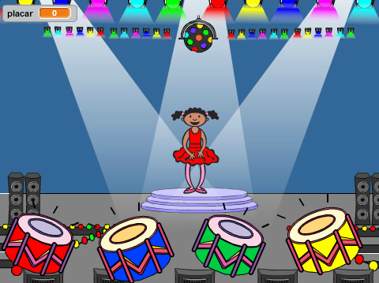

--- no-print ---

This is the **Scratch 2** version of the project. There is also a [Scratch 3 version of the project](https://projects.raspberrypi.org/pt-BR/projects/memory).

--- /no-print ---

## Introdução

Neste projeto, você criará um jogo de memória no qual você terá que memorizar e repetir uma sequência aleatória de cores!

### O que você vai fazer

Clique na bandeira verde para começar. Observe a sequência de cores mostrada pelo vestido da bailarina e ouça as batidas de tambor que as acompanham e repita-as de volta para ela. Se você errar a ordem, o jogo acaba!

  <iframe allowtransparency="true" width="485" height="402" src="https://scratch.mit.edu/projects/embed/239046838/?autostart=false" frameborder="0"></iframe>
  

### O que você vai aprender

Este projeto abrange elementos das seguintes vertentes do [Currículo de Criação Digital Raspberry Pi](http://rpf.io/curriculum){:target="_blank"}:

+ [Use construções básicas de programação para solucionar um problema.](https://www.raspberrypi.org/curriculum/programming/builder){:target="_blank"}

### Informação adicional para educadores

Se você precisar imprimir este projeto, por favor, use a [versão para impressão](https://projects.raspberrypi.org/pt-BR/projects/memory-scratch2/print){:target="_blank"}.

Use o link no rodapé para acessar o projeto no repositório do GitHub. Tal repositório contém todos os recursos (incluindo um exemplo de projeto concluído) na pasta 'pt-BR/resources'.