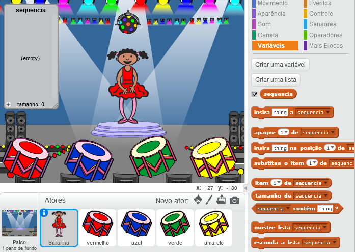

## Crie uma sequência de cores

Primeiro, vamos criar um personagem que mostrará uma sequência aleatória de cores para memorizar.

+ Inicie um novo projeto do Scratch e exclua o ator gato para que seu projeto fique vazio. Você pode usar o Scratch online [aqui](http://jumpto.cc/scratch-new).

+ Escolha um ator como seu personagem e um pano de fundo para o seu palco. O seu personagem não precisa ser uma pessoa, mas ele precisa ser capaz de mostrar cores diferentes.


+ Em seu jogo, você usará um número diferente para representar cada cor:
    
    + 1 = vermelho
    + 2 = azul
    + 3 = verde
    + 4 = amarelo
    
    Dê ao seu personagem quatro fantasias de cores diferentes, um para cada uma das quatro cores acima. Certifique-se de que a cor dos trajes estão na mesma ordem que a da lista acima.
    
    
    
    Você pode usar a ferramenta *Colorir uma forma* para preencher partes do traje com a cor desejada.

Vamos criar uma sequência aleatória de cores.

+ Crie uma lista chamada `sequência`{:class="blockdata"}. Usaremos essa lista para armazenar a sequência de cores que o jogador precisa lembrar. Apenas o ator precisa ver a lista, então você pode selecionar **Para este ator apenas**.

[[[generic-scratch-make-list]]]

Agora você pode ver a sua lista vazia no canto superior esquerdo do seu palco, bem como muitos novos blocos que podem ser usados para esta ou em outras listas.



+ Lembra que demos a cada cor um número? Podemos escolher uma cor aleatória escolhendo um número aleatório e adicionando-o à lista. Adicione este código:

```blocks
quando clicar em ⚑
insira (número aleatório entre (1) e (4)) a [sequencia v]
```

+ Teste seu código clicando na bandeira verde. Verifique se, cada vez que você clica nela, um número aleatório entre 1 e 4 aparece na lista.

+ Você pode adicionar este bloco ao seu programa para gerar cinco cores aleatórias de uma vez só?

```blocks
repita (5) vezes

end
```

+ Você pode notar que a sua lista está ficando cheia. Vamos adicionar um bloco para limpar a lista logo no início, antes de gerarmos qualquer número.

```blocks
quando clicar em ⚑
apague (todos v) de [sequencia v]
repita (5) vezes
   insira (número aleatório entre (1) e (4)) a [sequencia v]
end
```

+ Finalmente, cada vez que escolhemos um número, vamos mudar a cor da fantasia da bailarina para o último número que foi colocado na lista, que deve ser o número que acabamos de escolher. Adicione esses blocos ao seu código embaixo do bloco que adiciona o número aleatório à sua lista:

```blocks
mude para a fantasia (item (último v) de [sequencia v])
espere (1) seg
```