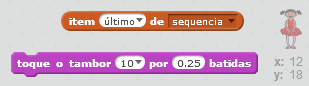

--- challenge ---

## Desafio: Adicionando som

Teste seu projeto algumas vezes. Você pode notar que as vezes o mesmo número é escolhido duas vezes (ou mais) seguidas, dificultando a memorização da sequência. Você consegue tocar um som de bateria cada vez que o personagem mudar a cor do seu traje?

Você pode tocar um som de bateria diferente dependendo do número escolhido? Isso será *muito* semelhante ao seu código para mudar a cor do traje do personagem.

--- hints --- --- hint --- Você pode completar este desafio apenas adicionando mais dois blocos no atual código do seu ator! --- /hint --- --- hint --- Estes são os blocos que você vai precisar:

 --- /hint ---

--- hint --- Aqui está como o seu código deve ficar:

```blocks
quando clicar em ⚑
apague (todos v) de [sequencia v]
repita (5) vezes
   insira (número aleatório entre (1) e (4)) a [sequencia v]
   toque o tambor (item (último v) de [sequencia v]) por (0.25) batidas
   mude para a fantasia (item (último v) de [sequencia v])
   espere (1) seg
end
```

--- /hint ---

--- /hints ---

--- /challenge ---