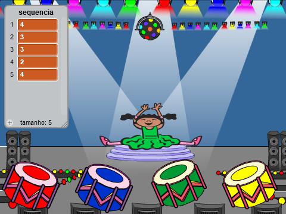
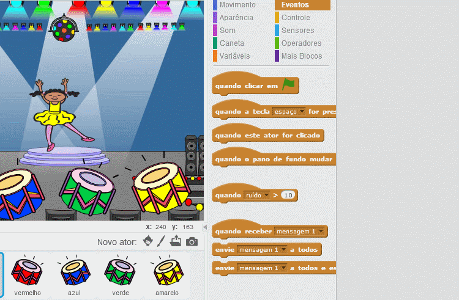
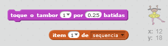
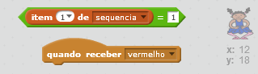

## Repetindo a sequência

Vamos adicionar quatro botões para o jogador pressionar (clicar) para repetir a sequência que ele lembrar.

+ Adicione quatro novos atores (tambores) ao seu projeto para representar os quatro botões. Edite os atores para que cada um fique com uma das quatro cores. Coloque os atores em ordem seguindo as seguintes cores - vermelho, azul, verde, amarelo.



+ Quando o tambor vermelho é clicado, você precisará transmitir uma mensagem ao seu personagem, informando-o que o botão vermelho foi clicado. Adicione este código ao seu tambor vermelho:

```blocks
    quando este ator for clicado
   envie [vermelho v] a todos
```

Uma transmissão é um pouco parecido com fazer um anúncio em um alto-falante - você já deve ter ouvido isso enquanto estava fazendo compras num supermercado. Todos os atores podem ouvir a mensagem, mas apenas o ator cujo trabalho é responder a esta mensagem fará algo.

+ Adicione um código semelhante ao do tambor vermelho aos tambores azul, verde e amarelo para que eles também transmitam uma mensagem sobre sua própria cor quando pressionados.

--- hints --- --- hint --- Aqui está uma maneira fácil de copiar o código de um tambor para outro. Mude a mensagem de transmissão em cada tambor para corresponder à sua cor.  --- /hint --- --- /hints ---

Lembra que dissemos que a transmissão é um pouco parecido com fazer um anúncio em um alto-falante? Apenas o ator cujo trabalho é responder a tal mensagem fará algo, então vamos fazer com que o personagem responda às mensagens. Fazemos isso escrevendo um código, que faz o personagem agir quando ouve uma determinada mensagem.

+ Quando seu personagem recebe a mensagem `vermelho`, o código deve verificar se o número `1` está no início da lista (o que significa que `vermelho` é a próxima cor na sequência).
    
    Se for a próxima cor da sequência, o código deve remover o número da lista, pois a cor foi lembrada corretamente. Caso contrário, o jogo acaba, usaremos o `pare todos`{:class="blockcontrol"} para parar o jogo.

```blocks
    quando receber [vermelho v]
    se <(item (1 v) de [sequencia v]:: list)=[1]> então
        apague (1 v) de [sequencia v]
    senão
        diga [Fim do jogo] por (1) segundos
        pare [todos v]
   fim
```

+ Adicione ao código que você acabou de escrever para que uma batida de tambor também seja reproduzida quando a cor correta for recebida.

--- hints --- --- hint --- Você consegue usar os números que correspondem a cada cor para tocar a batida correta?

+ 1 = vermelho
+ 2 = azul
+ 3 = verde
+ 4 = amarelo --- / hint --- --- hint --- Você precisará adicionar o bloco `toque o tambor`{:class="blocksound"} para reproduzir o primeiro som da lista antes do bloco `apagar 1 de sequencia`{:class="blockdata"}:

 --- /hint --- --- hint --- Aqui está o código que você vai precisar:

```blocks
toque o tambor (item (1 v) de [sequencia v]) por (0.25) batidas
```

--- /hint --- --- /hints ---

+ Duplique o código que você usou para fazer seu personagem responder à mensagem `vermelho`. E mude a mensagem para `azul`.

Quando o ator responde à mensagem `azul`, qual parte de código deve permanecer o mesmo, e qual parte deve mudar? Lembre-se de que cada cor tem um número correspondente.

+ Altere seu código para que o personagem responda corretamente ao recebimento da mensagem `azul`.

--- hints --- --- hint --- Mantenha esses blocos, mas você precisará alterá-los de alguma forma:  --- /hint --- --- hint --- Aqui está como seu código deve ficar para responder à transmissão da cor azul.

```blocks
    quando receber [azul v]
    se <(item (1 v) de [sequencia v]:: list)=[2]> então
        toque o tambor (item (1 v) de [sequencia v]:: list) por (0.25) batidas
        apague (1 v) de [sequencia v]
    senão
        diga [Fim do jogo] por (1) segundos
        pare [todos v]
   fim
```

--- /hint --- --- /hints ---

+ Duplique o código novamente mais duas vezes para o recebimento das mensagens verde e amarelo e altere as partes necessárias para que o personagem reaja corretamente.

+ Lembre-se de testar o código que você adicionou! Você consegue memorizar uma sequência de cinco cores? A sequência é diferente a cada vez?

Você também pode mostrar algumas luzes piscantes como comemoração por ter conseguido esvaziar a lista, isso significa que a seqüência inteira foi memorizada corretamente.

+ Adicione este código no final do bloco de código `quando clicar em bandeira verde`{:class="blockevents"} do seu personagem:

```blocks
    espere até < (tamanho de [sequencia v]:: list) = [0]>
    envie [VITÓRIA!!! v] a todos e espere
```

+ Mude para o palco e adicione este código para reproduzir um som e fazer o cenário mudar de cor quando o jogador ganhar. Você pode escolher qualquer som.

```blocks
    quando receber [VITÓRIA!!! v]
    toque o som [drum machine v]
    repita (50) vezes
        adicione ao efeito [cor v] (25)
        espere (0.1) seg
    fim
    apague os efeitos gráficos
```