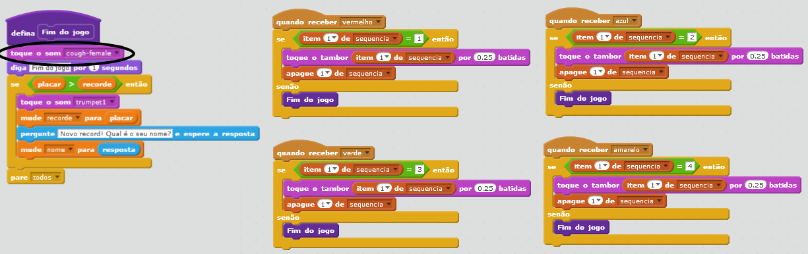

## Recorde

Vamos salvar o recorde (a pontuação mais alta), para que você possa desafiar seus amigos.

+ Adicione duas novas variáveis ​​chamadas `recorde`{:class="blockdata"} e `nome`{:class="blockdata"} ao seu projeto.

Quando o jogo terminar porque o jogador errou a sequência, você precisa verificar se a pontuação do placar é maior do que a mostrada no recorde atual. E se for, você precisa salvar a pontuação como o novo recorde e armazenar o nome do jogador.

+ Adicione o código ao personagem bailarina para salvar o recorde. Também peça ao jogador seu nome e salve-o na variável `nome`{:class="blockdata"}.

[[[generic-scratch-high-score]]]

--- hints --- --- hint --- Seu novo código precisa seguir a seguinte lógica: Depois da mensagem `Fim do jogo` `se` o `placar` for `maior que` o `recorde` `mude` o valor do `recorde` para o valor do `placar` `pergunte` o nome do jogador `mude` o `nome` para o dado na `resposta` --- /hint --- --- hint --- Você precisará dos seguintes blocos:


--- /hint --- --- hint --- Veja como o seu código deve ficar para quando o tambor vermelho for pressionado:

```blocks
    quando receber [vermelho v]
    se <(item (1 v) de [sequencia v]:: list)=[1]> então
        apague (1 v) de [sequencia v]
    senão
        diga [Fim do jogo] por (1) segundos
        se <(placar) > (recorde)> então
        pergunte [Novo recorde! Qual é o seu nome?] e espere a resposta
            mude [nome v] para (resposta)
        fim
        pare [todos v]
     fim
```

--- /hint --- --- /hints ---

+ Você precisará adicionar este novo código aos tambores das outras três cores também! Você já reparou que o código 'Fim do jogo' para cada uma das quatro cores é exatamente o mesmo?


As vezes que você for alterar este código, por exemplo, para adicionar um som ou alterar a mensagem "Fim de jogo", terá que alterá-lo quatro vezes. Isso além de chato ainda faz perder muito tempo.

Ao invés disso, você pode definir seus próprios blocos e reutilizá-los em seu projeto. Para fazer isso, clique em `Mais Blocos`{:class="blockmoreblocks"}, e em seguida **Criar um bloco**. Chame esse novo bloco de 'Fim do jogo'.


+ No código do tambor vermelho, substitua o bloco `se então`{:class="blockcontrol"} pelo bloco `se então senão`{:class="blockcontrol"}:


+ Você acabou de criar uma nova *função* chamada `Fim do jogo`{:class="blockmoreblocks"}, e agora pode usar em qualquer lugar que quiser. Arraste seu novo bloco `Fim do jogo`{:class="blockmoreblocks"} para os quatro scripts dos tambores.


+ Agora adicione um som para quando o tambor errado for pressionado. Você só precisa adicionar este código uma vez no bloco `Fim do jogo`{:class="blockmoreblocks"} que você fez, e não quatro vezes!

